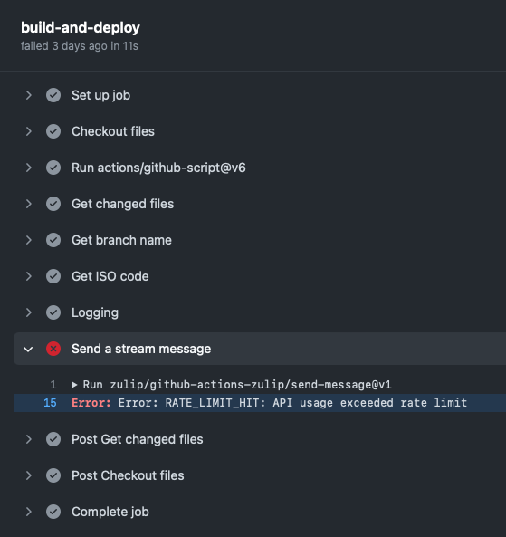

# Divvun-møte 7.11.2023

Til stades:  Linda, Børre, Flammie, Katri, Maja, Sjur

Saker:

* Sidan sist
* Borealium
* Arbeidstid og private reiser
* Reiser og konferansar
* LREC - framtidsplaner
* Ymse

# Sidan sist

## Maja
- Gramcheck - fraseverb - samlet mange nye interesante feiltyper
- Fonologi - 2.stavelsesvokal i NOUN-ODD
- En til som kan transkribere i 20 % stilling - Kan hun låne Divvuns mac-maskin? 

Framover:
- sende refusjon ang. Symposium
- Inncomming lemmalister - få oversikt - må spørre Børre og Flammi
- lag liste over hvilket materiale av alt som finnes av lydfiler, og hvor dette materalet er (ev med tekst) (i `speech-sma-x-private`)
    - konvertering frå CD til lydfiler etter avtale med Börre
- Syntaks: Gramcheck - yamltester, regel, feilmerking, presentasjon
- Fonologi - transkribering - TTS

## Flammie

* divvun-normalise issues <https://github.com/giellalt/lang-smj/issues/35>, <https://github.com/giellalt/lang-smj/issues/36>
* divvun keyboards crasher min mobil <https://github.com/divvun/giellakbd-android/issues/39> mens ä prövde å teste <https://github.com/divvun/giellakbd-android/issues/35>
* möte med linda om apertium
* hjelpte Judithe og Trond
    * autoconf regla om pip og lxml
* möte med Trond og Anders om masteroppgave i informatik

framover:
* list av navndeler
* moglege kandidatar for nytt Android-tastatur?
    * <https://github.com/topics/android-keyboard>
    * <https://alternativeto.net/list/31772/best-open-source-android-keyboards/>
    * <https://github.com/keymanapp/keyman>

## Linda

* kurs for Judithe fra oqaasileriffik i lag med Trond (kal grammatikkontroll)
* satt opp en enkel kal-grammatikkontroll med 2 regler
* grammatikkontrollmøte med Kevin (generell oppsett)
* la til dokumentasjon om grammatikkontroll
* apertium-møter med Flammie
* artikkelmøte med Marja-Liisa og Trond (smn-grammatikkontroll)
* artikkelmøte med Maja (sma grammatikkontroll)

## Børre

- [teste mobiltastatur](https://github.com/divvun/giellakbd-android/issues/35)
- UiT-utviklerlunch. Forelesning om Maui, multiplattform GUI
- flytte term til github. Gjorde det, men 130GB … må nok gjøre det på en annen måte
- forelesning om indigenous data i Google
- digt: fst og språksett for termer
- Sjekke [smn-tastatur på Windows](https://github.com/giellalt/keyboard-smn/issues/2)

Framover: gramcheck-test.py er inkonsistent på Mac og byggemaskiner

Flammie og Katri testar Divvun Dev-tastaturappen på Android-telefonane sine. Meld frå i buggmeldinga som det er lenka til over, inkl tekniske detaljar om telefonen.

## Katri

- utvikler evalueringsplatform for sme-tts
    - samarbeid med Trinity Dublin
    - oversetting fra eng til sme med Børre og sjekking av nettsider
    - har fått tilbakemelding om noe feiler som må enno fikses
- koordinert sme/sametinget transkribering
- jobber med tts http API med Brendan (nettside for å kunne bruke TTS)
- begynnt å bruke asr for smj tts material
- forelesning om samisk TTS for Giellagas
- møte: Monthly: Sami voice recognition, AI and Nordic PBs and universities

Framover/Ideer:
- Kanskje samarbeid med Giellagas - de har masse sme material som trenger transkribering -> bruke vår ASR -> mer treningsmaterial til oss
- NB: nordic automatic LID (language identification), kan brukes til å filtrere norsk material ut fra t.ex. sametingets plenumaudio

## Inga

- På reise i Canada.

## Sjur

- jobba litt vidare med Zulip-integrering
    - vi må sjekka at vi held oss innanfor mengda med meldingar som vi har lov til, jf [denne feilmeldinga](https://github.com/giellalt/lang-sje/actions/runs/6752331902/job/18357567582#step:8:16), og her som skjermbilete:\
    
- Google-førelesing
- siste runde med testing og tilbakemelding om iPad-tastatur, dei er no klare til publisering
- VislCG3-kontrakt
- møte med NRK m.fl.

Framover:
- risikovurdering for dei nye prosjekta (krevst for nye prosjekt)
- møte med GG-leiar, samling med GG neste år

## TheTC

- iPad-tastatur, no ferdige frå deira side

Framover:
- fiksa grammatikkontrollfeil i GDocs/Office

## Necessary Innovations

- arbeid med nettportalen
- Logo for Borealium
    - DEMO!!

## Andre planlagde oppdateringar

* stavekontroll inn i MT-sida igjen (unhammer)
* grammatikkontroll inn i MT-sida (unhammer)
* grammatikkontroll inn i LO (Kevin sin oxt)
* grammatikkontroll inn i nettstavekontrollen

# Borealium

Nytt utkast til logo. Demo.

# Arbeidstid og private reiser

Påminning.

# Reiser og konferansar

Tar alt for lang tid å få reiseoppgjer!
Et alternativ: https://cp.compendia.no/uit/medarbeiderhandbok/208693

Både potensielle og påmeldte, og planlagde reiser:

* 27.10.-9.11. Inga til Canada, National Gathering of Elders
* 1.-3.12. NLP4DH & IWCLUL <https://rootroo.com/en/joint-nlp4dh-iwclul-2023/>
* 17-22.3 EACL: <https://2024.eacl.org/calls/papers/#important-dates>
* april 2024: UNPFII i New York (i alle fall Inga og Sjur)
* 20.-25.05.2024 LREC-COLING Torino (13.10. submission)
* June 16–21, 2024 NAACL
* juni 2024: Språkteknologikonferanse i Bodø - alle?
* oktober 2024: Språkteknologikonferanse i Trondheim/Trøndelag - små språk i Norden, ev òg SMA-2-konferanse (mange/alle?), lansering av sørsamisk TTS

# LREC - framtidsplaner

* maori: grammatikkontroll, datastyring og tilgang, etikk og plattformkontroll
* nasjonalbiblioteket og samiske tekstar - skrive søknad til KD

# Ymse

Bør vi arrangera fleire release-partyar eller kurs på nettet? Kan kanskje nå fleire folk lettare på den måten. Målsetjing: nettseminar to gonger om året, 

* [IDIL - International Decade Of Indigenous Languages](https://fpcc.ca/stories/the-decade-of-indigenous-languages/)
* neste møte tysdag 14.11.2023, vanleg tid
* Neste Divvun-samling: kanskje veke 49, 4.-8.12.2023.
