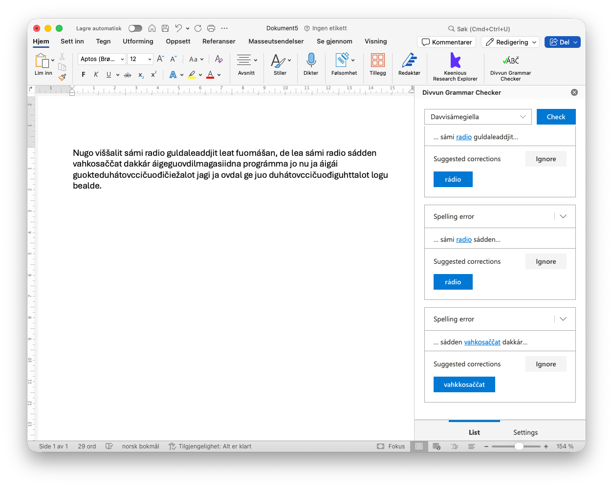

# Divvun-møte 5.5.2026

Til stades: Flammie, Sjur, Katri, Børre, Linda, Inga, Helena, Maja

Saker:

- Sidan sist
- Reiser og konferansar
- LREC - framtidsplanar
- Ymse

# Sidan sist

## Katri

- Fortsetter med en abstrakt om ASR-modeller til Fonetiikan päivät (DL 15.5.), har gjort en stor test med alle ASR-modeller

    > FILE: Ealli-arkiiva-Samii-Litto-doaimmain-ja-goddeshpnjagis-1970_VAD_003.wav
    > 
    > `Parakeet:` Okta ovdamearka golggotmánus duhátčiežalogi mii muitala dan ahte leat go dalle ge dahkkon njuolgga rádiosádat sámegillii. sáhka lea goddesáhpán ii ballodagas ja dan dagat dan áššiin luonddus ja boazodoalus ja de maiddái dán áigge dovddus sámesearvvi sámi lihtu.
  
    > `Whisper_Old:` ja dá okta ovdamearka golggotmánus dohko ovccičuođi čiežalogi mii muitala dan ahte leat dat dalle ge dahkkon njuolgan rádio sáddat sámegillii Sáhka lea goddesáhpánii valljo das ja dan dagathan áššiin luonddus ja boazodoalus ja de maiddái dán áigge dovddus sámesarvvi sámi lihtu
  
    > `wav2vec2:` ja dá okta ovdamearka golggotmánus duhátovccičuođičiežalogi mii muitala dan ahte leat dalle je dahkkon njuolgga rádiosáddagat sámegillii sáhka lea goddesáhpániid valjodagas ja dan dagat dan áššin luonddus ja boazodoalus ja de maiddái dan áigge dovddus sámesearvvi sámi lihttu
  
    > `Whisper_New:` Ja dát oktavdamearkan golggotmánus ovttačuođi čiežalogi mii muitala, danne ahte lehpet dalle ja dahkkon njuolgga rádios addat sámegillii. sáhka lea goddesáhpán ii válljoga oas ja danne dagat danne áššiin luonddus ja boazodoalus ja de maiddái danáigge dovddus sámi lihtu.
    > 
- Planen er å kjøre alle outputter gjennom gram/spellcheck og finjustere ASR-modellene med "signal" fra checkere.
- Lene og UiT sin innkjøpt(?) ASR modell [Klartekst](https://klartekst.uit.no/) -> samarbeid med oss og?
    - Klartekst is a transcription service based on artificial intelligence for staff and students at UiT.
    - The service is based on artificial intelligence and it supports the National Library of Norway's NB-whisper model, which is trained on Norwegian content.
- Artikkelreview til Journal of Uralic Linguistics om nordsamisk ASR.
- SAALS7 accepted.

Framover/Ideer:
- Combined TTS/ASR with new technologies
- [Aalto ASR-demo](https://huggingface.co/spaces/GetmanY1/sami_asr) (test gjerne!)
- kontakt med/om LIA Sápmi: avtale må fylles inn
- publisering av datasetter for alle TTS-prosjekter??
- Undersøker en mulighet for å få GUI for Whisper-modeller
- Undersøker TTS til Anki (språklæringssapp) via API
- Til folk som er interessert av TTS-prosjekter: <https://docs.coqui.ai/en/latest/what_makes_a_good_dataset.html>

## Linda

- grammar checker feedback og sme GramDivvun
- sme GramDivvun regler
- Nordlyd redaksjonsarbeid
- sørsamisk grammatikkontroll med Maja
- artikkelmøte med Trond
- godkjent NORDPLUS søknad

## Sjur

- prosjektstilling for Jietnašiella: fire søkjarar, intervju denne veka
- møte med NRK, SVT m.fl.
- arbeid med SMA-stavekontrollen: kvaliteten på forslaga er no bra (nok)
- arbeid med lang-ciw
- har prata med Trond om LIA Sápmi - avtale signert og sendt til Oslo

## Børre

- Jietnašiella
  - ortnet anársámi jorgalusaid Google Docs-árkkas
  - guokte čoahkkima, plánen ja barggu sisdoaluin
  - backend: hálddašit máŋggagielat sisdoalu
  - gieđahit geassebargiid ohcamiid Jietnašellii, ovttas Sjurain
- lang-smj: kompilerenváttisvuođat jna ovttas Iŋggáin
- lang-sma: missinglisttuid ovttas Majain
- gut:
  - [divustit siva](https://github.com/divvun/divvun-actions/commit/e830731ad3d455f31159e1a7145a9bed82230a47) manne mu evttohusat eai huksejuvvo
- termwiki: dikšut sisdoalu

Boahtteáiggis:
- få pontoon til å virkelig synkronisere
- [Borealium1.1/Nordisk ministerråd](https://github.com/orgs/borealium/projects/1):
- laga oppsett for gramcheck-testdata i cg3-filer

##  Flammie
 
* tivvum muáddi ucceeb feilâ hfst:st (=>hfst-3.17.1 jna.)
    * `hfst-lexc -Werror` logihkkâfeilâid
    * hfst-pmatch2fst `Lst()` lii prosesserejuvvom automátlâš 
* lexc-syntáksâtivvomeh lang-sma:st já ja lang-sme:st hfst-3.17:ân 
* uddâ dokumentasjona spellervektingâ pirrâ <https://giellalt.github.io/proof/TheSpellerErrorModel.html#corpus-weight>
* keessiluámupláneh dfo:ân

## Maja Lisa

- lemma fra Gg
- gramcheck - plural-nouns m/regler + 2.st.vokal - tvilstilfeller

Fremover:
- SMA-stavekontroll - dårligst på forslag - git-historie, 
Forslagsmekanismen - Flammi eksp. med maskinlæring, klassifiserte feilene
 
## Helena

- Gulahallan sámedikkiin leanaid namaid normerema birra
- Čohkken vel eanet nuppiid sámegielaid báikenamaid davvisámegielas. Got mii dal mannat viidáseappot dainna, dal go Iŋgá lea fas dáppe? 
- Feedback
    - Liikot + illatiiva -njuolggádus - galgá go cealkit ahte liikot gáibida illatiivva? Giellagáldui jearaldat.
- Girona sámisearvi Giellavahkku v.43
- Veahá adm.áššit: luomut, mátkki diŋgon, selvan ja deklarašuvdna jna

## Inga

- Mye hjelp fra Børre
- Rettet på fail i smj
- Laget lister med cmp og delt med Giellagálldo
- Drag Skoles ordbok

Fremover:
- Få lang-smj på føttene
 
## Necessary Innovations

- byggjeinfra-arbeid (CI og loggar)
- dokumentasjonsinfra

---

Framover:

- nytt installeringsprogram
- oppdatert kbdgen:
    - linux-tastatur

# Reiser og konferansar

Tidsfrister for å sende artikkel eller abstrakt:
- 15/05/2026 Fonetiikan päivät (på Aalto Universitet)
- 21/08/2026 https://spelll.org/imp-dates.html (December 17-19, 2026 - (Hybrid Mode))
- after august probs ??? IWCLUL München 10th --- 11th December

Både potensielle og påmeldte, og planlagde reiser:

- seinare: sigmorphon eller andre tba
- 4.-5. juni: Dialogkonferanse, Sametinget og Udir i Alta (Inga)
- 15-18 juni Gávnnadeapmi 3 Ohcejohka
- 18-21 juni Sámiid konferánsa Ohcejohka
- Midtsommerhelga 2026: Ankarede - rekruttering av sma-studenter 
- July 4th, 2026 - [ComputEL 2026](https://computel-workshop.org/computel-9/submission-information/), San Diego, California 
- oktober/november 2026: Oppfølgingskonferanse etter Trondheimskonferansen sist november, i Helsingfors
- 4.-5.11.2026: 7th Saami Linguistics Symposium [SAALS7](https://site.nord.no/saami-linguistics-symposium-7), Nord Universitet, Bodø. Frist for sammendrag: 10.4.2026
- 12.-16.4.2027 Tromsø CG-seminar
- 20.-24.9.2027 Nuuk CG-seminar

# LREC - framtidsplanar

- maori: grammatikkontroll, datastyring og tilgang, etikk og plattformkontroll
- nasjonalbiblioteket og samiske tekstar - skrive søknad til KD

# Ymse

- neste samling: siste veka i mai, berre fire dagar, måndagen er 2. pinsedag;
- Tartu-folk på besøk i slutten av mai
- Brendan kjem òg då

Neste møte: tysdag 12.5.2026 til vanleg tid
