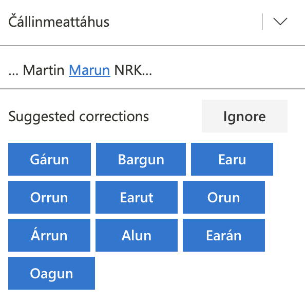

# Grammatikkontroll og stavekontroll

Kvifor får vi så dårlege forslag frå stavekontrollen?

Møte 25.9.2023 med Linda, Maja, Sjur

# SME

> Guovllu šibit doavttir jáhkká sávccaid leamaš jápmán máŋga vahku ovdal go fuomašuvvoje.

Setninga inneheld to skrivefeil, _sávccaid_ (skal vera `sávzzaid`) og _fuomašuvvoje_ (skal vera `fuomášuvvoje`).

## Rein skrivefeil

Med forslag frå stavekontrollen, slik dei kjem fram i grammatikkontrollen:


Første forslag er best, men det kommer forslag som er merkelige, f.eks. `n-ávccaid-e`

Her er utdata frå grammatikkontrollen:

```
: 
"<sávccaid>"
	"sávza" §TH N Sem/Ani Pl Acc <W:26.2573> <WA:11.2573> <spelled> "sávzzaid"S PROTECT:3480 SELECT:3715 &SUGGESTWF &typo #5->4 SUBSTITUTE:5197 ADD:10186:spelled
typo
	"sávza" §TH N Sem/Ani Pl Gen <W:26.2573> <WA:11.2573> <spelled> "sávzzaid"S PROTECT:3480 SELECT:3715 &SUGGESTWF &typo #5->4 SUBSTITUTE:5197 ADD:10186:spelled
typo
	"šákša" §TH N Sem/Ani-fish Pl Acc <W:44.3018> <WA:14.3018> <spelled> "šávššaid"S PROTECT:3480 SELECT:3715 &SUGGESTWF &typo #5->4 SUBSTITUTE:5197 ADD:10186:spelled
typo
	"šákša" §TH N Sem/Ani-fish Pl Gen <W:44.3018> <WA:14.3018> <spelled> "šávššaid"S PROTECT:3480 SELECT:3715 &SUGGESTWF &typo #5->4 SUBSTITUTE:5197 ADD:10186:spelled
typo
	"sevsa" §TH N Sem/Dummytag Pl Acc <W:45.3018> <WA:15.3018> <spelled> "sevssaid"S PROTECT:3480 SELECT:3715 &SUGGESTWF &typo #5->4 SUBSTITUTE:5197 ADD:10186:spelled
typo
	"sevsa" §TH N Sem/Dummytag Pl Gen <W:45.3018> <WA:15.3018> <spelled> "sevssaid"S PROTECT:3480 SELECT:3715 &SUGGESTWF &typo #5->4 SUBSTITUTE:5197 ADD:10186:spelled
typo
	"sovsa" §TH N Sem/Food Pl Acc <W:46.3018> <WA:15.3018> <spelled> "sovssaid"S PROTECT:3480 SELECT:3715 &SUGGESTWF &typo #5->4 SUBSTITUTE:5197 ADD:10186:spelled
typo
	"sovsa" §TH N Sem/Food Pl Gen <W:46.3018> <WA:15.3018> <spelled> "sovssaid"S PROTECT:3480 SELECT:3715 &SUGGESTWF &typo #5->4 SUBSTITUTE:5197 ADD:10186:spelled
typo
	"sokča" v1 §TH N Sem/Tool-catch Pl Acc <W:46.3018> <WA:15.3018> <spelled> "sovččaid"S PROTECT:3480 SELECT:3715 &SUGGESTWF &typo #5->4 SUBSTITUTE:5197 ADD:10186:spelled
typo
	"sokča" v1 §TH N Sem/Tool-catch Pl Gen <W:46.3018> <WA:15.3018> <spelled> "sovččaid"S PROTECT:3480 SELECT:3715 &SUGGESTWF &typo #5->4 SUBSTITUTE:5197 ADD:10186:spelled
typo
	"čakča" §TH N Sem/Time Pl Acc <W:46.3018> <WA:15.3018> <spelled> "čavččaid"S PROTECT:3480 SELECT:3715 &SUGGESTWF &typo #5->4 SUBSTITUTE:5197 ADD:10186:spelled
typo
	"čakča" §TH N Sem/Time Pl Gen <W:46.3018> <WA:15.3018> <spelled> "čavččaid"S PROTECT:3480 SELECT:3715 &SUGGESTWF &typo #5->4 SUBSTITUTE:5197 ADD:10186:spelled
typo
	"sokčá" §TH N Sem/Hum Pl Acc <W:47.3018> <WA:15.3018> <spelled> "sovččáid"S PROTECT:3480 SELECT:3715 &SUGGESTWF &typo #5->4 SUBSTITUTE:5197 ADD:10186:spelled
typo
	"sokčá" §TH N Sem/Hum Pl Gen <W:47.3018> <WA:15.3018> <spelled> "sovččáid"S PROTECT:3480 SELECT:3715 &SUGGESTWF &typo #5->4 SUBSTITUTE:5197 ADD:10186:spelled
typo
	"cukca" §TH N Sem/Txt Pl Acc <W:60.3018> <WA:15.3018> <spelled> "cuvccaid"S PROTECT:3480 SELECT:3715 &SUGGESTWF &typo #5->4 SUBSTITUTE:5197 ADD:10186:spelled
typo
	"cukca" §TH N Sem/Txt Pl Gen <W:60.3018> <WA:15.3018> <spelled> "cuvccaid"S PROTECT:3480 SELECT:3715 &SUGGESTWF &typo #5->4 SUBSTITUTE:5197 ADD:10186:spelled
typo
	"coakci" §TH N Sem/Dummytag Pl Acc <W:66.3018> <WA:15.3018> <spelled> "covcciid"S PROTECT:3480 SELECT:3715 &SUGGESTWF &typo #5->4 SUBSTITUTE:5197 ADD:10186:spelled
typo
	"coakci" §TH N Sem/Dummytag Pl Gen <W:66.3018> <WA:15.3018> <spelled> "covcciid"S PROTECT:3480 SELECT:3715 &SUGGESTWF &typo #5->4 SUBSTITUTE:5197 ADD:10186:spelled
typo
	"nákca" §TH N <TH-Inf> Sem/Feat-psych Pl Acc <W:69.8188> <WA:9.8188> <spelled> "návccaid"S SUBSTITUTE:5001 PROTECT:3480 SELECT:3715 &SUGGESTWF &typo #5->4 SUBSTITUTE:5197 ADD:10186:spelled
typo
	"nákca" §TH N <TH-Inf> Sem/Feat-psych Pl Gen <W:69.8188> <WA:9.8188> <spelled> "návccaid"S SUBSTITUTE:5001 PROTECT:3480 SELECT:3715 &SUGGESTWF &typo #5->4 SUBSTITUTE:5197 ADD:10186:spelled
typo
;	"sávccaid" ? SELECT:3715
: 
```

Det som er tydeleg er at det er stor skilnad i vekta på forslaga. Ved å leggja inn ein regel som fjernar forslag med vekt meir enn 20 høgare enn beste forslag, vil dei fleste forslaga med ulik fyrstebokstav (og dermed usannsynlege) bli fjerna. Dette kunne vera ein generell regel heilt i slutten av `tools/grammarcheckers/spellchecker.cg3`.

Dessverre er dette ikkje mogleg, jf svar frå Tino (men sjå [denne](https://github.com/GrammarSoft/cg3/issues/131)):

> Math is not currently possible. Only min/max queries and > or < a constants, but can't compare values against each other.

Dvs at ein regel som fjernar alle forslag med vekt over `60` er mogleg. Ein slik regel ville ha fjerna dei seks siste analysane i kohorten over = dei tre siste forslaga. Ein kan sjølvsagt prøva seg fram med andre tal enn `60`.

Andre ting å gjera betre:

- [forslaga bør nummererast](https://github.com/divvun/divvun-gramcheck-web/issues/85), slik at ein direkte ser kva som er best (sett frå grammatikkontrollen)
- [forslaga bør venstrejusterast vertikalt](https://github.com/divvun/divvun-gramcheck-web/issues/86), og i eit rutenett, ikkje flytande som no - kanskje som ei liste som går over to spalter med meir enn 5 forslag

## Urimelege forslag frå grammatikkontrollen


Feilen er ein lang-A-feil, så det einaste forslaget vi vil ha er nr to i lista. Her er analysene av dei to andre forslaga:

```
fuomášuvvojedje
fuomášuvvojedje	fuomášit+V+TV+Der/PassL+V+IV+Ind+Prt+Pl3	0.000000

fuomášuvvoje
fuomášuvvoje	fuomášit+V+TV+Der/PassL+V+IV+Ind+Prs+Du1+Err/Orth	0.000000
fuomášuvvoje	fuomášit+V+TV+Der/PassL+V+IV+Ind+Prt+Pl3
```

Utdata frå grammatikkontrollen er:

```
: 
"<fuomašuvvoje>"
	"fuomášit" Err/Orth-a-á Ex/V Ex/TV Gram/3syll Der/PassL <mv> V <TH-Inf> <0> <TH-Inf> <TH-ahte> IV Ind Prs Du1 Err/Orth <W:0.0> SUBSTITUTE:2509 SUBSTITUTE:2956 SUBSTITUTE:4827 SUBSTITUTE:2958 @FS-<ADVL MAP:16662:r406 &typo #11->11 SUBSTITUTE:3993:SubV=mv SUBSTITUTE:4033:SubV=FS-<ADVLmv ADD:10194:Err/Orth-any COPY:10203:Err/Orth-any
typo
	"fuomášit" Ex/V Gram/3syll Der/PassL <mv> V <TH-Inf> <0> <TH-Inf> <TH-ahte> Ind Prs Du1 <W:0.0> SUBSTITUTE:2509 SUBSTITUTE:2956 SUBSTITUTE:4827 SUBSTITUTE:2958 @FS-<ADVL MAP:16662:r406 &SUGGEST #11->11 SUBSTITUTE:3993:SubV=mv SUBSTITUTE:4033:SubV=FS-<ADVLmv ADD:10194:Err/Orth-any COPY:10203:Err/Orth-any SUBSTITUTE:10268:Ex/tags
fuomášit+Ex/V+Gram/3syll+Der/PassL+V+Ind+Prs+Du1	fuomášuvvojetne
	"fuomášit" Ex/V Ex/TV Gram/3syll Der/PassL <mv> V <TH-Inf> <0> <TH-Inf> <TH-ahte> Ind Prs Du1 <W:0.0> SUBSTITUTE:2509 SUBSTITUTE:2956 SUBSTITUTE:4827 SUBSTITUTE:2958 @FS-<ADVL MAP:16662:r406 &typo #11->11 SUBSTITUTE:3993:SubV=mv SUBSTITUTE:4033:SubV=FS-<ADVLmv ADD:10194:Err/Orth-any COPY:10203:Err/Orth-any
typo
	"fuomášit" Err/Orth-a-á Ex/V Ex/TV Gram/3syll Der/PassL <mv> V <TH-Inf> <0> <TH-Inf> <TH-ahte> IV Ind Prt Pl3 <W:0.0> SUBSTITUTE:2509 SUBSTITUTE:2956 SUBSTITUTE:4827 SUBSTITUTE:2958 @FS-<ADVL MAP:16662:r406 &typo #11->11 SUBSTITUTE:3993:SubV=mv SUBSTITUTE:4033:SubV=FS-<ADVLmv ADD:10194:Err/Orth-any COPY:10203:Err/Orth-any
typo
	"fuomášit" Ex/V Gram/3syll Der/PassL <mv> V <TH-Inf> <0> <TH-Inf> <TH-ahte> Ind Prt Pl3 <W:0.0> SUBSTITUTE:2509 SUBSTITUTE:2956 SUBSTITUTE:4827 SUBSTITUTE:2958 @FS-<ADVL MAP:16662:r406 &SUGGEST #11->11 SUBSTITUTE:3993:SubV=mv SUBSTITUTE:4033:SubV=FS-<ADVLmv ADD:10194:Err/Orth-any COPY:10203:Err/Orth-any SUBSTITUTE:10268:Ex/tags
fuomášit+Ex/V+Gram/3syll+Der/PassL+V+Ind+Prt+Pl3	fuomášuvvoje,fuomášuvvojedje
	"fuomášit" Ex/V Ex/TV Gram/3syll Der/PassL <mv> V <TH-Inf> <0> <TH-Inf> <TH-ahte> Ind Prt Pl3 <W:0.0> SUBSTITUTE:2509 SUBSTITUTE:2956 SUBSTITUTE:4827 SUBSTITUTE:2958 @FS-<ADVL MAP:16662:r406 &typo #11->11 SUBSTITUTE:3993:SubV=mv SUBSTITUTE:4033:SubV=FS-<ADVLmv ADD:10194:Err/Orth-any COPY:10203:Err/Orth-any
typo
;	"fuomášit" Ex/V Ex/TV Gram/3syll Der/PassL V <0> <TH-Inf> <TH-ahte> IV Ind Prs Du1 Err/Orth Err/Spellrelax <W:0.0> SUBSTITUTE:2509 SUBSTITUTE:2956 SUBSTITUTE:4827 REMOVE:2099
;	"fuomášit" Ex/V Ex/TV Gram/3syll Der/PassL V <0> <TH-Inf> <TH-ahte> IV Ind Prt Pl3 Err/Spellrelax <W:0.0> SUBSTITUTE:2509 SUBSTITUTE:2956 SUBSTITUTE:4827 REMOVE:2099
```

Dette viser at det er to ting som må rettast:

- må velja Pl3-lesingane framfor Du1-lesingane; dette er ein homonymi som gjeld likestava verb, men gjeld han andre verbklasser? Kan vi fjerna slik homonymi allereie i lexc? Eller [gjera feilen meir eksplisitt](https://github.com/giellalt/lang-sme/issues/71)? Då kan den analysen lettare disambiguerast vekk, og vi får fjerna det mest irrelevante forslaget (som faktisk kjem fyrst).
- PrtPl3-forma har to variantar, og så lenge vi ikkje kan skilja dei frå kvarandre kan vi heller ikkje generera den varianten som er brukt i feilskrivinga. Vi bør difor [opna opp for varianttaggar i bøyingsparadigma](https://github.com/giellalt/lang-sme/issues/72), der det er relevant. Med ein slik tagg kan vi generera berre og einast det forslaget vi vil ha.

## Meiningslause forslag / manglande ord i leksikon

> – Politiijaid ovddal boahtá olmmoš geas leat guokte niibbi gieđas. Ii jeagat ja váccaša olggos sisa campingvovnnas, muitala Finnmárkku politiija Martin Marun NRK Finnmarkui.



Her er det eit etternamn som vi ikkje har i leksikonet, og stavekontrollen gjettar vilt. Det beste er å fjerna alle forslag i slike tilfelle:

- hvis ordet skrives med stor førstebokstav og ordet til venstre er fornavn så eksluderer vi alle forslag som ikkje er navn

Ved å la proprium stå att som forslag vil dei i det minste gje meining for brukarane. Dei forslaga som kjem no er meiningslause.

# SMA

> \- Sæjhta Njoktegaajsan dåeriedidh?

stavekontrollen gir:

> Johtegaajsan, Joksegaajsan, Jïktegaajsan Tjodtegaajsan, Njoktjegaajsan

Det er det 5. ordet vi önsker på topp. Hvordan få de gode forslagene lenger opp?

```shell
echo 'Sæjhta Njoktegaajsan dåeriedidh?' | ./tools/grammarcheckers/modes/trace-smagram-release.mode
```

Det gjev:

```
"<Sæjhta>"
	"sïjhtedh" V TV Ind Prs Sg3 <W:0.0> @+FAUXV MAP:1841
: 
"<Njoktegaajsan>"
	"Njoktegaajsan" ? &typo ADD:1208:uncorrected-typos
typo
	"gaejsie" N Sem/Plc Sg Ill <W:34.4951> <WA:14.4951> <spelled> "johtegaajsan"S <sma> ADD:2650:sme ADD:10:spelled &SUGGESTWF &typo
		"johte" N Sem/Dummytag Cmp/SgNom Cmp
typo
	"gaejsie" N Sem/Plc Sg Ill <W:34.4951> <WA:14.4951> <spelled> "jïktegaajsan"S <sma> ADD:2650:sme ADD:10:spelled &SUGGESTWF &typo
		"jïkte" N Sem/Dummytag Cmp/SgNom Cmp
typo
	"gaejsie" N Sem/Plc Sg Ill <W:34.4951> <WA:14.4951> <spelled> "njoktjegaajsan"S <sma> ADD:2650:sme ADD:10:spelled &SUGGESTWF &typo
		"njoktje" N Sem/Ani_Time Cmp/SgNom Cmp
typo
	"gaejsie" N Sem/Plc Sg Ill <W:34.4951> <WA:14.4951> <spelled> "tjodtegaajsan"S <sma> ADD:2650:sme ADD:10:spelled &SUGGESTWF &typo
		"tjodte" N Sem/Dummytag Cmp/SgNom Cmp
typo
	"gaejsie" N Sem/Plc Sg Ill <W:34.4951> <WA:14.4951> <spelled> "joksegaajsan"S <sma> ADD:2650:sme ADD:10:spelled &SUGGESTWF &typo
		"jokse" N Sem/Dummytag Cmp/SgNom Cmp
typo
: 
"<dåeriedidh>"
	"dåeriedidh" V TV Inf <W:0.0> @-FMAINV MAP:1857:InfinMainv SELECT:1913:InfIfInfv
;	"dåeriedidh" V TV Ind Prt Pl2 <W:0.0> SELECT:1913:InfIfInfv
"<?>"
	"?" CLB <W:0.0>
:\n
```

I grammatikkontrollen får alle forslaga akkurat same vekt (`34,4951`). Her er resultata frå stavekontrollen som blir brukt i grammatikkontrollen, men køyrt åleine på kommandolina:

```shell
echo '5 Njoktegaajsan' | hfst-ospell-office -d tools/spellcheckers/sma.zhfst |\
tr '\t' '\n'
@@ Loading tools/spellcheckers/sma.zhfst with args max-weight=-1.00, beam=-1.00, time-cutoff=6.00
@@ hfst-ospell-office is alive
&
Johtegaajsan (34.50;0)
Joksegaajsan (34.50;0)
Jïktegaajsan (34.50;0)
Njoktjegaajsan (34.50;0)
Tjodtegaajsan (34.50;0)
```

Same vekt på alle forslaga her òg. Med `divvunspell` er det *ikkje* same vekt:

```shell
echo Njoktegaajsan | divvunspell suggest -a tools/spellcheckers/sma.zhfst 
Reading from stdin...
Input: Njoktegaajsan		[INCORRECT]
Njoktjegaajsan		44.49508
Johtegaajsan		59.49508
Joksegaajsan		59.49508
Jïktegaajsan		59.49508
Njoejegaajsan		59.49508
Njoektjegaajsan		59.49508
Njoektsegaajsan		59.49508
Njoelegaajsan		59.49508
Njoeregaajsan		59.49508
Njoetsegaajsan		59.49508
```

Heller ikkje når vi slår av handteringa av store bokstavar for å få så lik oppførsel med `hfst-ospell` som mogleg:

```shell
echo njoktegaajsan | divvunspell suggest --no-case-handling \
-a tools/spellcheckers/sma.zhfst
Reading from stdin...
Input: njoktegaajsan		[INCORRECT]
njoktjegaajsan		24.49508
johtegaajsan		34.49508
joksegaajsan		34.49508
jïktegaajsan		34.49508
njoejegaajsan		34.49508
njoektjegaajsan		34.49508
njoektsegaajsan		34.49508
njoelegaajsan		34.49508
njoeregaajsan		34.49508
njoetsegaajsan		34.49508
```

Rein `hfst-ospell` fungerer likt med `divvunspell`:

```shell
echo njoktegaajsan | hfst-ospell -S tools/spellcheckers/sma.zhfst 
"njoktegaajsan" is NOT in the lexicon:
Corrections for "njoktegaajsan":
njoktjegaajsan    24.495081
johtegaajsan    34.495079
njoejegaajsan    34.495079
njohkegaajsan    34.495079
tjodtegaajsan    34.495079
njorkegaajsan    34.495079
njoktjigaajsan    34.495079
njoktjefaajsan    34.495079
```

Dvs at problemet ligg i `hfst-ospell-office` slik programmet er brukt i grammatikkontrollen. Som ein del av prosjektet med å integrera grammatikkontrollen i diverse system skal den komponenten bytast ut med `divvunspell`, men det vil ta tid. Sjur kan be om at den biten av prosjektet blir gjennomført tidleg, og implementert uavhengig av resten, slik at vi kan forbetra forslaga i grammatikkontrollen før prosjektet er ferdig.
