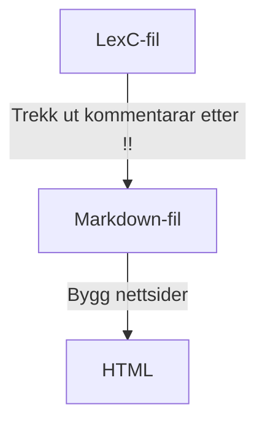

# Markdown og dokumentasjon

23.3.2022

Til stades:

- Børre
- Flammie
- Inga
- Katri
- Lene
- Linda
- TrondTr
- TrondTy
- Sjur

Mål:

- betre dokumentasjon
- alle skriv dokumentasjon som ein del av dei vanlege rutinane

# Kva då? Dokumentasjon?

Kven skriv vi for:
- for oss sjølve om 1-2 år
- nye folk
- andre interesserte (all dokumentasjon ligg på nettet!)

# Kor ligg dokumentasjonen?

   repo/katalog    | nett-url
------------------ | --------
giellalt.github.io | giellalt.github.io
lang-XXX/docs/     | giellalt.github.io/lang-XXX

ALL kjeldekode som inneheld kommntarar på forma `!! ` blir lagt til
automatisk i lang-XXX/docs når ein sjekkar inn, treng ikkje å spesifisera
filene.

# Kjapp repetisjon - Markdown

Sjå [dokkommentardokumentasjonen](https://giellalt.github.io/infra/infraremake/In-sourceDocumentationSpecification.html).

# Korleis bygginga fungerer

<!-- generated by mermaid compile action - START -->

  
Mermaid markup

<!-- generated by mermaid compile action - END -->

Alt skjer automatisk når ein sjekkar inn.

# Korleis kan eg sjå kva resultatet blir på mi eiga maskin?

- skriv kommentarar i lexc/cg3/...
- køyr `make` i `docs/`-katalogen
- opne den genererte md-fila i `see` eller ein annan editor som kan visa Markdown

# Allment om dokumentasjon

- All annan dokumentasjon enn kjeldekodekommentarar skal liggja i `docs/`-mappa
- i `docs/`-mappa kan ein organisera dokumentasjonen som ein vil
