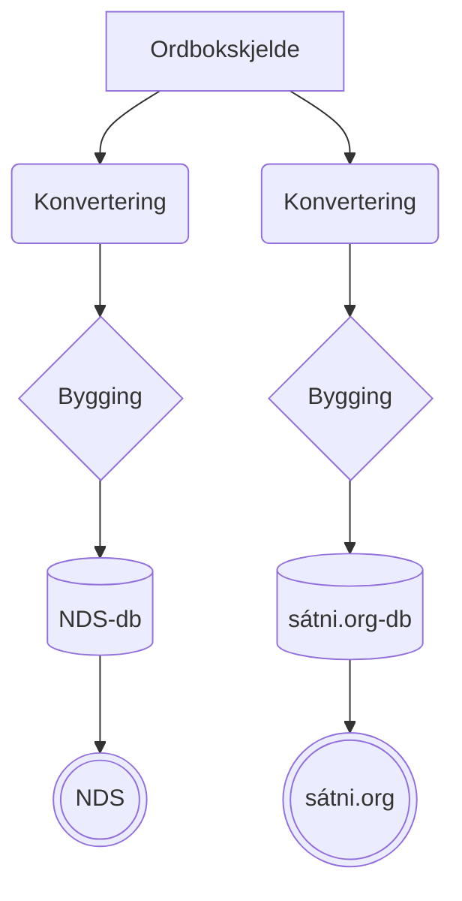
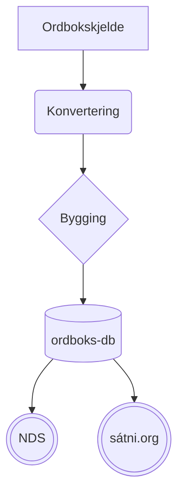

# Status for infra - møte 25.10.2023

Folk: Anders, Børre, Flammie, Sjur

Saker:
- jf førre møtet i august

# Kommentert opprit frå [førre møtet](2023-08-30-infra-status.md)

> * omorganisera [fst-bygginga](https://github.com/giellalt/template-lang-und/issues/8)

Ugjort.

> * omorganisera testkatalogane

Ugjort.

> * flytta fleire repo frå svn til git(hub)

Punktvis:

> Lister:
> - som genererte artifaktar i github-release-pakkesystemet
> - i svn til vi har det på plass

Ugjort. Ikke pri.

> Terminologi:
> - planlegg flyttinga
> - vidare diskusjonar i GitHub-prosjekt el.

Gjøres i løpet av året


> Ordbøker:
> - org på same måte som `lang-`katalogane, prefiks `dict-`
> - script osb i `giella-core`
> - reponamn: `dict-` L1 `-` L2; L2<1 => L2 = `mul`
> - døme på reponamn: `dict-sma-nob`, `dict-myv-mul`
> - dicts/scripts, dicts/dtd og Makefile må inn i giella-core 
> - doc? dev?

Gjort.

> * oahpa
>     * oahpa ligg i ped-katalogen, som også inneheld andre ting enn oahpa. Vi må (bør?) skilje dei frå kvarandre.

- Lage plan for git-flytting med Trond & Lene

> * tools
>     * Her er det mange ulike ting, også irrelevante. Vi kan rydde eller flytte alt.

- fjern det som alt har vorte flytta til git
- de som ikke er flyttet settes under Divvun/Giellatekno etter hvem som hovedsaklig har jobbet med det

> * Definerte oppgaver på github
>     * [Proper support for Alt-Orth and Alt-WS etc for mobile spellers](https://github.com/giellalt/giella-core/issues/2)
>     * [Add support for lexc in GH Linguist](https://github.com/giellalt/giella-core/issues/16)
> 
> Sjå òg <https://github.com/orgs/giellalt/projects/1>.

Lav pri

> # Azure og IT-folka
>
> - domener:
>    * antar at de subdomenene av uit.no vi har i dag kan overføres,
>    men vil høre mulighetene rundt domenenavn (særlig underdomener av
>    `*.uit.no`, e.g. som i dag: gtweb, gtdict, ..., men kan vi få nye?
>    f.eks `korp.uit.no`?)

Ja, vi kan få subdomener, og de kan endres på. Så lenge det ikke er konflikter, er det rett fram.

> - bygge-infrastruktur: Azure Pipelines?
>   kostnader med dette? Vi har potensiellt sett noen store bygge-pipelines
> - machine-learning-relaterte jobber.

Azure Pipelines vil fungere fint.

> - økonomi: hva dekker ITA, hva må avdelingene dekke?

Uavklart

## Ordbokssamarbeid (teknisk)

Mål: unngå dobbeltarbeid. Slik vi arbeider no er nesten alt dobbelt:

<!-- generated by mermaid compile action - START -->

<details>
  <summary>Mermaid markup</summary>



</details>
<!-- generated by mermaid compile action - END -->

Målet bør heller vera noko i stil med:

<!-- generated by mermaid compile action - START -->

<details>
  <summary>Mermaid markup</summary>



</details>
<!-- generated by mermaid compile action - END -->

Vi tek det stegvis dit. Ein start:

- Steg 1: Lage oversikt over hvilke konkrete funksjonaliteter bruker vi?
- Steg 2: Finne ut hva som er likt, og bruke samme biblioteker.
- Eks: merge_giella_dicts.py - samler alle lemmatagger i samme fil

## Felles API

- Mål: Lage ett API som alle tjenester bruker, som har alle språkverktøy og pipelines

## Miljøvariablar i den nye Git-verda

```
export GUTHOME="$HOME/repos"
export GTLANGS="$GUTHOME/giellalt"
export GIELLA_CORE="$GTLANGS/giella-core"
test -r "$GIELLA_CORE"/devtools/init.d/init.sh && . "$GIELLA_CORE"/devtools/init.d/init.sh
```

## rust-bindinger til libhfst og vislcg3

- lage root bindinga: libhfst-sys, og så lage ideomatisk wrapper

## standard rutinar for å parsa data frå hfst og vislcg3

- sjå `cg-conv`
- bør programmet bli brukt meir systematisk?

# Møte i framtida

- kvar gong vi er samla i Tromsø
- ev ein gong i månaden, på nett når ikkje i Tromsø
