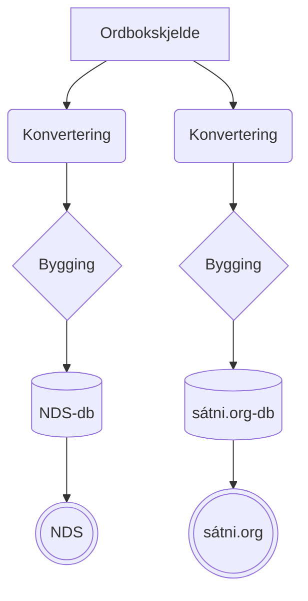
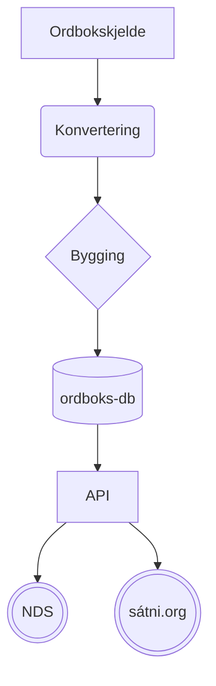

# Status for infra - møte 5.12.2023

Folk: Anders, Børre, Flammie, Sjur, Trond

Saker:
- jf førre møtet i oktober
- Bugzilla

## Kommentert opprit frå [førre møtet](2023-10-25-infra-status.md)

> * omorganisera [fst-bygginga](https://github.com/giellalt/template-lang-und/issues/8)

Ugjort. 

### 2023-12-05

Flammie jobbar med dette i romjula, med utgangspunkt
i strukturen skissert i [den siste kommentaren her](https://github.com/giellalt/template-lang-und/issues/8#issuecomment-1016422817)

Ferdige fst-filer skal lagrast i `src/fst/`, dei temporære filene skal leggjast i ein usynleg katalog `src/fst/.deps/`, med unnatak
av `lexicon.tmp.lexc`

> * omorganisera testkatalogane

Ugjort. Gjer vi etter omorganiseringa av fst-katalogen (sjå over).

> * flytta fleire repo frå svn til git(hub)

Punktvis:

> Lister:
> - som genererte artifaktar i github-release-pakkesystemet
> - i svn til vi har det på plass

Ugjort. Ikke pri.

> Terminologi:
> - planlegg flyttinga
> - vidare diskusjonar i GitHub-prosjekt el.

2023.12.05: ~~Gjøres i løpet av året~~ Vi utset dette til seinare, ikkje prioritert no.

> * oahpa
>     * oahpa ligg i ped-katalogen, som også inneheld andre ting enn oahpa. Vi må (bør?) skilje dei frå kvarandre.

For git vs. svn: Det er greiare å ha det i git enn i svn. Vi flyttar sjølve katalogen frå `$GTHOME/ped`  til ` $GUTHOME/giellalt/oahpa` 

Her er to moglege modellar for modularisering:

1. Legge språkspesifikke ped-filer i `lang-XXX/tools/oahpa` 
2. Ha eigne katalogar `tuellalt/oahpa-XXX` 

> * tools
>     * Her er det mange ulike ting, også irrelevante. Vi kan rydde eller flytte alt.

- fjern det som alt har vorte flytta til git
- de som ikke er flyttet settes under Divvun/Giellatekno etter hvem som hovedsaklig har jobbet med det

> * Definerte oppgaver på github
>     * [Proper support for Alt-Orth and Alt-WS etc for mobile spellers](https://github.com/giellalt/giella-core/issues/2)
>     * [Add support for lexc in GH Linguist](https://github.com/giellalt/giella-core/issues/16)
> 
> Sjå òg [infrabyggeprosjektet](https://github.com/orgs/giellalt/projects/1) på github.

Lav pri

### Ordbokssamarbeid (teknisk)

Mål: unngå dobbeltarbeid. Slik vi arbeider no er nesten alt dobbelt:



Målet bør heller vera noko i stil med:



Vi tek det stegvis dit. Ein start:

- Steg 1: Lage oversikt over hvilke konkrete funksjonaliteter bruker vi?
- Steg 2: Finne ut hva som er likt, og bruke samme biblioteker.
- Eks: merge_giella_dicts.py - samler alle lemmatagger i samme fil

### Felles API

- Mål: Lage ett API som alle tjenester bruker, som har alle språkverktøy og pipelines

### Miljøvariablar i den nye Git-verda

```
export GUTHOME="$HOME/repos"
export GTLANGS="$GUTHOME/giellalt"
export GIELLA_CORE="$GTLANGS/giella-core"
test -r "$GIELLA_CORE"/devtools/init.d/init.sh && . "$GIELLA_CORE"/devtools/init.d/init.sh
```

### rust-bindinger til libhfst og vislcg3

- lage root bindinga: libhfst-sys, og så lage ideomatisk wrapper
- 2023-12-05: [divvunspell](https://github.com/divvun/divvunspell): rust-bibliotek som leser og forstår `.hfst`-filer (eigentleg `.zhfst`-filer)

### standard rutinar for å parsa data frå hfst og vislcg3

- sjå `cg-conv`
- bør programmet bli brukt meir systematisk?
- 2023-12-05: anders: prototype underveis

# Bugzilla

Possible [converter](https://github.com/berestovskyy/bugzilla2github)

- Børre konverterer
- vi konverterer alle, inkl dei lukka (av historiske grunnar)
- kategorisering etter GH-issues må gjerast manuelt, men det ser vi på i lag seinare
- fjern søppel og spam!
- pass på konvertering av bilete!
