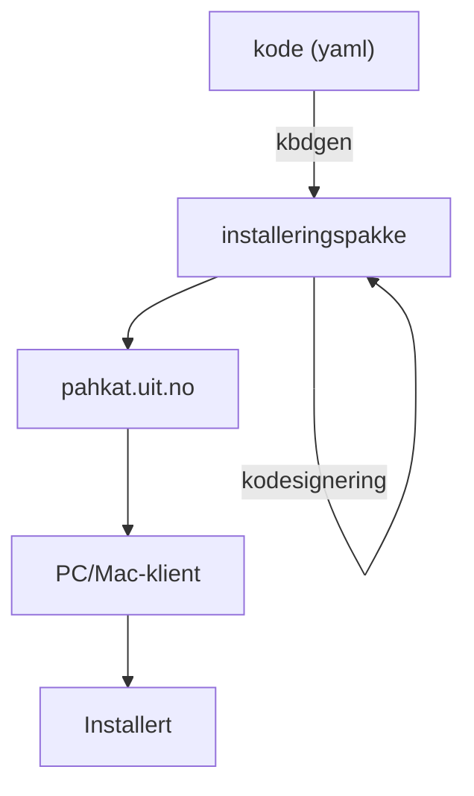
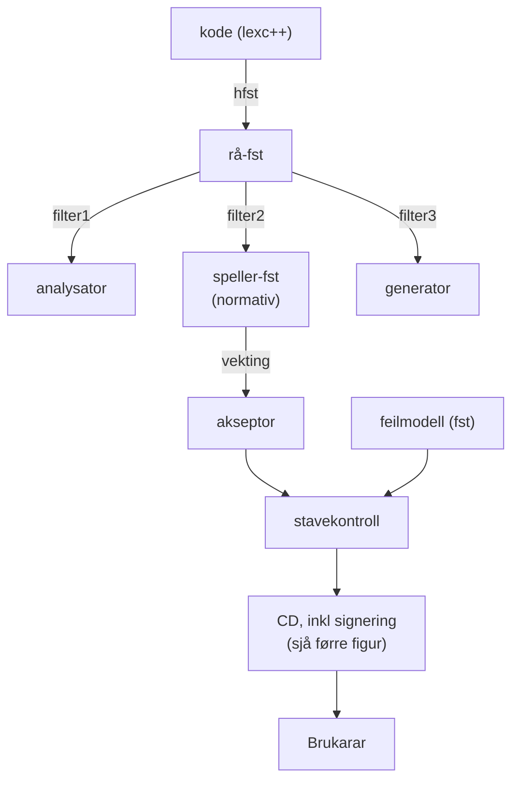

# Testing, infra og distribusjon

Tema:
- tastatur
- stavekontroll
- svensk fst - frå Helsingfors/Hfst?

## Tastatur

Frå kode til installert tastatur:

```yaml
android:
  config:
    spellerPackageKey: https://pahkat.uit.no/main/packages/speller-fit?channel=nightly&platform=mobile
    spellerPath: fit.bhfst
  primary:
    layers:
      default: |
        q w e r t y u i o p å
        a s d f g h j k l ö ä
        \s{shift} z x c v b n m . \s{backspace}
      shift: |
        Q W E R T Y U I O P Å
        A S D F G H J K L Ö Ä
        \s{shift} Z X C V B N M . \s{backspace}

```

CI/CD:



## Stavekontroll

`tools/spellcheckers`
`test/tools/spellcheckers/`



## Svensk fst - frå Helsingfors/Hfst?

- <https://metashare.csc.fi/repository/browse/hfst-swedish-morphology-based-on-den-stora-svenska-ordlistan/6c9da7ba397511e8b228005056be118e490ac1635b25480c9843b5cd7aab9ddf/>
- dvs <https://korp.csc.fi/download/hfst-morphologies/sv/dsso/>

Den originale kjeldekoden finst ikkje på nett lenger, og blir ikkje oppdatert eller halde ved like, jf [Wordfeud och Den Stora Svenska Ordlistan](https://www.ajour.se/wordfeud-och-den-stora-svenska-ordlistan/). Dessverre.
