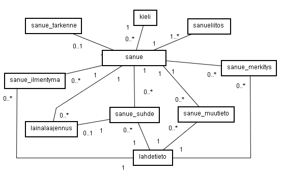
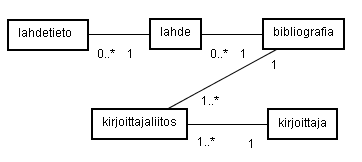
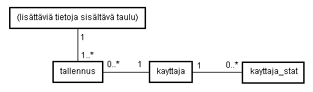

**ÁLGU-TIETOKANTA  
TIETOKANNAN DOKUMENTAATIO**  
  
Ville Tikkaoja 27.4.2008  
Kotimaisten kielten tutkimuskeskus  
  
Tietokannan versio 3.2  
  
  
**Sisältö**

[1. Johdanto](#1)  
[1. Unicode](#1.1)  
[2. Taulut](#2)  
[2.1. Yleistä](#2.1)  
[2.2. Tauluesittelyt](#2.2)  
[3. Tietokannan rakenne](#3)  
  
  

------------------------------------------------------------------------

  
  
**1. JOHDANTO**

Tämä dokumentti käsittelee ÁLGU-tietokantajärjestelmän varsinaista
tietokantaa. Dokumentissa selostetaan tietokannan
suunnitteluperiaatteet, rakenne ja esitellään tietokantataulut.

Tietokanta on toteutettu SQL-pohjaisena MySQL-tietokantaohjelmistolla.
Tietokanta on suunniteltu relaatiotietokannan periaatteiden mukaisesti.
Eli eri tauluissa oleva tieto liittyy toisiinsa ja eri tietoja
talletetaan vain silloin kun on tarkoitus, jolloin ei turhaan pidetä
yllä ns. tyhjää tietoa.

  
  
**1.1. UNICODE**

Käytössä oleva MySQL:n versio on 5.0. Se tukee Unicode-standardin
mukaista UTF-8 -koodausta. Unicode-tuki ei kuitenkaan ole täydellinen.
MySQL ei tällä hetkellä tue Unicoden normalisointia. Tästä syystä
tietokantaan tallennettu tekstidata normalisoidaan NFD-muotoon ennen
tietokantaan tallentamista, jolloin normalisointiongelmasta päästään
suurilta osin eroon. On kuitenkin huomioitava, että esim. vertailuja
varten kaikki syötteet on aina ensin normalisoitava tai muuten vertailut
eivät toimi.

  
  
**2. TAULUT**

**2.1. YLEISTÄ**

Yleistä tietoa tässä kappaleessa esiteltävistä tietokanan tauluista:

Tietokantatauluista esitetään attribuuttien määritykset SQL:n CREATE
TABLE -lauseina.  

Lekseemien tauluissa lekseemi\_id-attribuutti viittaa lekseemi-taulun
vastaavan id:n mukaiseen riviin riviin. Erillinen tieto liittyy siis
näin tiettyyn lekseemiin.  

Sanueiden tauluissa sanue\_id-attribuutti viittaa sanue-taulun vastaavan
id:n mukaiseen riviin riviin. Erillinen tieto liittyy siis näin tiettyyn
sanueeseen.  

Taulujen indekseinä (ja osittain muina tietoina) käytettävät
INT-arvoiset attribuuteille on asetettu UNSIGNED-määre, joka poistaa
käytöstä negatiiviset arvot siirtämällä tämän joukon verran arvoja
positiiviselle puolelle. Eli positiivisten arvojen määrä tuplaantuu.
Näin saadaan enemmän arvoja käyttöön, koska negatiivisia arvoja ei
käytetä koskaan.  

Kaikissa tauluissa indeksinä käytettävä attribuuteille on lisäksi
asetettu AUTO\_INCREMENT-määre, joka yksikäsitteistää jokaisen taulun
rivin kasvattamalla ko. sarakkeen arvoa aina yhdellä edellisestä.
Tällaiselle sarakkeelle on annettava INSERT-komennossa arvoksi 0 tai
jättää ko. sarake kokonaan syöttämättä, jotta tietokannan oma
seuraavaksi suurin luku asettuu.

  
  
**2.2. TAULUESITTELYT**

**KIELI-taulu**

Kieli-taulu esittää kieliä, joihin voi kuulua lekseemejä ja sanueita.

    CREATE TABLE kieli (
            id              INT NOT NULL AUTO_INCREMENT,
            jarjestys       INT NOT NULL,
            nimi            VARCHAR(100) CHARACTER SET utf8 NOT NULL,
            lyhenne         VARCHAR(20) CHARACTER SET utf8 NOT NULL,
            kieliryhma      INT NOT NULL,
            valintaryhma    INT NOT NULL,
            PRIMARY KEY (id));

Attribuuttien selitys:

`id              INT NOT NULL AUTO_INCREMENT`  
Kielen yksikäsitteistävä id-numero.

`jarjestys       INT NOT NULL`  
Kielen järjestysnumero kieliryhmän sisällä.

`nimi            VARCHAR(100) NOT NULL`  
Kielen nimi.

`kieliryhma      INT NOT NULL`  
0 = jos kyseessä normaali kieli, 1 = jos kyseessä kieliryhmä

`valintaryhma    INT NOT NULL`  
Kielivalintaryhmä, johon ko. kieli kuuluu. Järjestelmän kielivalikon
valinnaiset kielet esitetään sen mukaan mikä kielivalintaryhmä on
valittu. Tämä liittyy kielivalintaryhma-tauluun.

Kieli-taulu esittää kieliä, joihin voi kuulua lekseemejä ja sanueita.

  
  
**KIELIVALINTARYHMA-taulu**  

    CREATE TABLE kielivalintaryhma (
            id              INT NOT NULL,
            jarjestys       INT NOT NULL,
            nimi            VARCHAR(100) CHARACTER SET utf8 NOT NULL,
            kielijoukko     INT NOT NULL,
            PRIMARY KEY(id));

Attribuuttien selitys:

`id              INT NOT NULL AUTO_INCREMENT`  
Kielivalintaryhmän yksikäsitteistävä id-numero.

`jarjestys       INT NOT NULL`  
Kielivalintaryhmän järjestysnumero kielijoukon sisällä..

`nimi            VARCHAR(100) CHARACTER SET utf8 NOT NULL`  
Kieli-taulun kielen id, johon ko. lekseemi kuuluu.

`kielijoukko     INT NOT NULL`  
Kielijoukko, johon kielivalintaryhmä kuuluu. 1 = ieur, 2 = ural, 3 =
muu.

Kielivalintaryhmät, joihin varsinaiset kielet (kieli-taulu) kuuluvat.
Käytetään mm. muodostamaan hakutoiminnon kielivalikot.

  
  
**LEKSEEMI-taulu**  

    CREATE TABLE lekseemi (
            id              INT UNSIGNED NOT NULL AUTO_INCREMENT,
            kieli_id        INT UNSIGNED NOT NULL,
            PRIMARY KEY (id),
            INDEX kieli_id_index (kieli_id));

Attribuuttien selitys:

`id        INT UNSIGNED NOT NULL AUTO_INCREMENT`  
Lekseemin yksikäsitteistävä id-numero.

`kieli_id  INT UNSIGNED NOT NULL`  
Kieli-taulun kielen id, johon ko. lekseemi kuuluu.

Lekseemi-taulu on tietokannan ydin. Taulu määrittää lekseemin, sanan,
johon voi kuulua lisää muuta tietoa muista tauluista id:n mukaan
liitettynä. Lekseemi kuuluu aina johonkin kieleen. Muuta tietoa lekseemi
ei yksistään oletusarvoisesti sisällä. Tämän katsottiin olevan järkevä
ratkaisu, jotta lekseemiin voidaan tarvittaessa liittää vain ja
ainoastaan tarvittavaa tietoa. Lekseemi koostuu kokonaisuudessaan
tarkenteesta, ilmentymistä, merkityksistä, suhteista toisiin
lekseemeihin ja ns. muusta tiedosta.

  
  
**TARKENNE-taulu**  

    CREATE TABLE tarkenne (
            id              INT UNSIGNED NOT NULL AUTO_INCREMENT,
            lekseemi_id     INT UNSIGNED NOT NULL,
            tarkenne        VARCHAR(80) CHARACTER SET utf8,
            varmennettu     INT,
            PRIMARY KEY (id));

Attribuuttien selitys:

`id              INT UNSIGNED NOT NULL AUTO_INCREMENT`  
Tarkenteen yksikäsitteistävä id-numero.

`lekseemi_id     INT UNSIGNED NOT NULL`  
Lekseemin id, johon ko. tarkenne kuuluu.

`tarkenne        VARCHAR(80) CHARACTER SET utf8`  
Tarkenneteksti.

`varmennettu     INT`  
Tieto onko tarkenne varmennettu. 0 = ei, 1 = kyllä.

Tarkenteella lekseemin yhteyteen lisätään tarkempi tieto kieleen
liittyen jos kyse on esim. jostain murteesta.

  
  
**ILMENTYMA-taulu**  

    CREATE TABLE ilmentyma (
            id              INT UNSIGNED NOT NULL AUTO_INCREMENT,
            lekseemi_id     INT UNSIGNED NOT NULL,
            ortognro        INT NOT NULL,
            ilmentyma       VARCHAR(100) CHARACTER SET utf8,
            ilmentyma_p     VARCHAR(100) CHARACTER SET utf8
            homonyymi_id    INT,
            numero          VARCHAR(20) CHARACTER SET utf8,
            varmennettu     INT,
            aakk            INT UNSIGNED
            PRIMARY KEY (id),
            INDEX lid_index (lekseemi_id));

Attribuuttien selitys:

`id        INT UNSIGNED NOT NULL AUTO_INCREMENT`  
Ilmentymän yksikäsitteistävä id-numero.

`lekseemi_id   INT UNSIGNED NOT NULL`  
Lekseemin id, johon ko. ilmentyma kuuluu.

`ortognro  INT NOT NULL`  
Ilmentymän ortografianumero. Ilmentymiä on sekä päälähteenmukaisia että
lähteenmukaisia. Päälähteitä on enintään 3 kpl kieltä kohden ja kullekin
päälähteelle on olemassa yksi päälähteen mukainen ilmentymä lekseemiä
kohden. ortognro-attribuutin arvot 1, 2 ja 4 tarkoittavat päälähteen
mukaista ilmentymää. Lisäksi lekseemillä voi olla useita lähteenmukaisia
ilmentymiä, jotka esitetään ortognro-attribuutin arvolla 3. Epälooginen
järjestys johtuu myöhemmin tehdystä kolmannen päälähteen lisäyksestä.

`ilmentyma VARCHAR(100) CHARACTER SET utf8`  
Ilmentyma, eli sanan kirjoitusasu merkkijonona

`ilmentyma_p   VARCHAR(100) CHARACTER SET utf8`  
Ilmentyman pelkistetty muoto, jossa joitain merkkejä on poistettu.

`homonyymi_id    INT`  
Ilmentymän homonyymi-indeksi.

`numero          VARCHAR(20) CHARACTER SET utf8`  
Ilmentymän numeroarvoinen ilmentymä. Numeroarvoa voidaan käyttää joko
varsinaisen ilmentymän sijaan tai myös sen rinnalla. Myös numeroarvolla
haetaan ilmentymiä. Numeroarvo on merkkijono, koska se sisältää
mahdollisesti pisteitä tai kaksoispisteitä.

`varmennettu   INT`  
Tieto onko ilmentyma varmennettu. 0 = ei, 1 = kyllä.

Ilmentyma-taululla esitetään lekseemien ortografioiden formatiivien
ilmentymät.

  
  
**MERKITYS-taulu**  

    CREATE TABLE merkitys (
            id              INT UNSIGNED NOT NULL AUTO_INCREMENT,
            lekseemi_id     INT UNSIGNED NOT NULL,
            ortognro        INT NOT NULL,
            kieli           VARCHAR(50) NOT NULL,
            merkitys        TEXT CHARACTER SET utf8 NOT NULL,
            varmennettu     INT,
            PRIMARY KEY (id),
            INDEX lid_index (lekseemi_id));

Attribuuttien selitys:

`id        INT UNSIGNED NOT NULL AUTO_INCREMENT`  
Merkityksen yksikäsitteistävä id-numero.

`lekseemi_id   INT UNSIGNED NOT NULL`  
Lekseemin id, johon ko. merkitys kuuluu.

`ortognro        INT NOT NULL`  
Kuvaa mihin ortografiaan merkitys liittyy. Merkityksiä on sekä
päälähteenmukaisia että lähteenmukaisia. Päälähteitä on 2 kpl kieltä
kohden ja kullekin päälähteelle on olemassa yksi päälähteen mukainen
merkitys lekseemiä kohden. ortognro-attribuutin arvot 1, 2 ja 4
tarkoittavat päälähteen mukaista ilmentymää. Lisäksi lekseemillä voi
olla useita lähteenmukaisia merkityksiä, jotka esitetään
ortognro-attribuutin arvolla 3. Epälooginen järjestys johtuu myöhemmin
tehdystä kolmannen päälähteen lisäyksestä.

`kieli     VARCHAR(50) NOT NULL`  
Merkityksen kieli.

`merkitys  TEXT CHARACTER SET utf8 NOT NULL`  
Merkityks merkkijonona.

`varmennettu   INT`  
Onko merkitys varmennettu. 0 = ei, 1 = kyllä.

Merkitys esittää lekseemin sanallisen merkityksen. Merkityksen tietoihin
kuuluu tieto kielestä, jolla se on esitetty. Merkityksiä voi kuulua
lekseemin useita (ks ortognro-attribuutti).

  
  
**SUHDE-taulu**  

    CREATE TABLE suhde (
            id              INT UNSIGNED NOT NULL AUTO_INCREMENT,
            lekseemi1_id    INT UNSIGNED NOT NULL,
            suhdetyyppi     INT NOT NULL,
            lekseemi2_id    INT UNSIGNED NOT NULL,
            varmuusaste     INT NOT NULL,
            implisiittinen  INT NOT NULL,
            varmennettu     INT,
            PRIMARY KEY (id),
            INDEX st_index (suhdetyyppi));

Attribuuttien selitys:

`id        INT UNSIGNED NOT NULL AUTO_INCREMENT`  
Suhteen yksikäsitteistävä id-numero.

`lekseemi1_id  INT UNSIGNED NOT NULL`  
Suhteen yhden pään lekseemin id. Ks lekseemi2\_id.

`suhdetyyppi   INT NOT NULL`  
Suhdetyypin määrittelevä numero.

Suhdetyypit:

1 = vastinesuhde  
2 = johtosuhde  
3 = lainasuhde  
5 = vertaussuhde  
6 = kielteinen vastinesuhde  
7 = kielteinen johtosuhde  
8 = kieleinen lainasuhde  
10 = kielteinen vertaussuhde  

Tyypit 4 ja 9 puuttuvat, koska niillä aikanaan esitetty korrelaatiosuhde
on poistettu käytöstä.

`lekseemi2_id  INT UNSIGNED NOT NULL`  
Suhteen yhden pään lekseemin id. Ks lekseemi1\_id.

`varmuusaste     INT NOT NULL`  
Suhteen varmuusaste. 1 = varma, 2 = epävarma.

`implisiittinen  INT NOT NULL`  
Onko suhde implisiittinen, eli päätelty. 1 = on 0 = ei.  
Suhteet (vastine- ja johtosuhteet) päätellään aina suhteen lisäyksen
yhteydessä. Päätellyt suhteet tallennetaan kantaan, koska näin
käyttöliittymästä saadaan nopeampi. Suhteiden päättely joka vaiheessa
osoittautui turhan hitaaksi. Suhteen implisiittisyys voitaisiin
selvittää myös lähdetiedoista (päätellyllä ei ole lähdettä), mutta
tämäkin aiheuttaisi turhia tietokantaoperaatioita käyttöliittymässä

`varmennettu   INT`  
Onko suhde varmennettu. 0 = ei, 1 = kyllä.

Suhde on konkreettisesti suhde kahden eri lekseemin välillä. Se yhdistää
kaksi lekseemiä attribuuttien lekseemi1\_id ja lekseemi2\_id mukaan
suhdetyypin määrittelemään suhteeseen. Suhteet toimivat yleensä
molemminsuuntaisesti lekseemien välillä.

Vastine- ja johtosuhteiden osalta järjestelmässä suoritetaan ko.
suhteiden lisäyksen aikana päättelyä. Lekseemistä lähtevän suhdeverkon
transitiivisuus selvitetään ja lisätään implisiittiset suhteet niiden
lekseemien väliin, joista suhde transitiivisuuden mukaan puuttuu.

  
  
**MUUTIETO-taulu**  

    CREATE TABLE muutieto (
            id              INT UNSIGNED NOT NULL AUTO_INCREMENT,
            lekseemi_id     INT UNSIGNED NOT NULL,
            tieto           VARCHAR(255) CHARACTER SET utf8,
            varmennettu     INT,
            PRIMARY KEY (id));

Attribuuttien selitys:

`id        INT UNSIGNED NOT NULL AUTO_INCREMENT`  
Muun tiedon yksikäsitteistävä id-numero.

`lekseemi_id   INT UNSIGNED NOT NULL`  
Lekseemin id, johon muu tieto liittyy.

`tieto     VARCHAR(255) CHARACTER SET utf8`  
Muun tiedon teksti merkkijonona.

`varmennettu   INT`  
Onko muu tieto varmennettu. 0 = ei, 1 = kyllä.

Muu tieto esittää lekseemin jotain muuta tietoa, jota ei muulla tavalla
voida esittää.

  
  
**SANUE-taulu**  

    CREATE TABLE sanue (
            id              INT UNSIGNED NOT NULL AUTO_INCREMENT,
            kieli_id        INT UNSIGNED NOT NULL,
            eduslekseemi    INT UNSIGNED NOT NULL,
            PRIMARY KEY (id));

Attribuuttien selitys:

`id              INT NOT NULL AUTO_INCREMENT`  
Sanueen yksikäsitteistävä id.

`kieli_id        INT UNSIGNED NOT NULL`  
Sanueen kieli. Viittaa kieli-tauluun.

`eduslekseemi    INT UNSIGNED NOT NULL`  
Sanueen eduslekseemi, jonka mukaan sanueelle tulee ilmentymä. Viittaa
lekseemi-tauluun.

Sanue on lekseemiin verrattava kokonaisuus. Taulu määrittää sanueen,
johon voi kuulua lisää muuta tietoa muista tauluista id:n mukaan
liitettynä. Sanue kuuluu aina johonkin kieleen. Muuta tietoa sanue ei
yksistään oletusarvoisesti sisällä. Sanue koostuu kokonaisuudessaan
tarkenteesta, ilmentymistä, merkityksistä, suhteista toisiin sanueisiin
ja ns. muusta tiedosta.

  
  
**SANUELIITOS-taulu**  

    CREATE TABLE sanueliitos (
            id              INT UNSIGNED NOT NULL AUTO_INCREMENT,
            lekseemi_id     INT UNSIGNED NOT NULL,
            sanue_id        INT UNSIGNED NOT NULL,
            PRIMARY KEY (id));

Attribuuttien selitys:

`id              INT UNSIGNED NOT NULL AUTO_INCREMENT`  
Sanueliitoksen id.

`lekseemi_id     INT UNSIGNED NOT NULL`  
Sanueeseen liittyvä lekseemi. Viittaa lekseemi-tauluun.

`sanue_id        INT UNSIGNED NOT NULL`  
Mihin sanueeseen lekseemi\_id:n viittaama lekseemi kuuluu.

Taulu esittää sanueisiin kuuluvat lekseemit.

  
  
**SANUE\_ILMENTYMA-taulu**  

    CREATE TABLE sanue_ilmentyma (
            id              INT UNSIGNED NOT NULL AUTO_INCREMENT,
            sanue_id        INT UNSIGNED NOT NULL,
            ilmentyma       VARCHAR(255) CHARACTER SET utf8,
            varmennettu     INT,
            PRIMARY KEY (id));

Attribuuttien selitys:

`id                INT UNSIGNED NOT NULL AUTO_INCREMENT`  
Ilmentymän yksikäsitteistävä id-numero.

`sanue_id       INT UNSIGNED NOT NULL`  
Sanue id, johon ko. ilmentyma kuuluu. Viittaa sanue-tauluun.

`ilmentyma VARCHAR(255) CHARACTER SET utf8`  
Ilmentyma, eli sanan kirjoitusasu merkkijonona

`varmennettu       INT`  
Tieto onko ilmentyma varmennettu. 0 = ei, 1 = kyllä.

Sanue\_ilmentyma-taulussa esitetään sanueiden lähteenmukaiset
ilmentymät.

  
  
**SANUE\_MERKITYS-taulu**  

    CREATE TABLE sanue_merkitys (
            id              INT UNSIGNED NOT NULL AUTO_INCREMENT,
            sanue_id        INT UNSIGNED NOT NULL,
            kieli           VARCHAR(50) NOT NULL,
            merkitys        TEXT CHARACTER SET utf8,
            toimittaja      INT,
            varmennettu     INT,
            PRIMARY KEY (id));

Attribuuttien selitys:

`id                INT UNSIGNED NOT NULL AUTO_INCREMENT`  
Merkityksen yksikäsitteistävä id-numero.

`lekseemi_id       INT UNSIGNED NOT NULL`  
Lekseemin id, johon ko. merkitys kuuluu.

`ortognro        INT NOT NULL`  
Kuvaa mihin ortografiaan merkitys liittyy. Merkityksiä on sekä
päälähteenmukaisia että lähteenmukaisia. Päälähteitä on 2 kpl kieltä
kohden ja kullekin päälähteelle on olemassa yksi päälähteen mukainen
merkitys lekseemiä kohden. ortognro-attribuutin arvot 1 ja 2
tarkoittavat päälähteen mukaista merkitystä. Lisäksi lekseemillä voi
olla useita lähteenmukaisia merkityksiä, jotka esitetään
ortognro-attribuutin arvolla 3.

`kieli             VARCHAR(50) NOT NULL`  
Merkityksen kieli.

`merkitys  TEXT CHARACTER SET utf8`  
Merkityks merkkijonona.

`varmennettu       INT`  
Onko merkitys varmennettu. 0 = ei, 1 = kyllä.

Merkitys esittää sanueen sanallisen merkityksen. Merkityksen tietoihin
kuuluu tieto kielestä, jolla se on esitetty.

  
  
**SANUE\_SUHDE-taulu**  

    CREATE TABLE sanue_suhde (
            id              INT UNSIGNED NOT NULL AUTO_INCREMENT,
            sanue1_id       INT UNSIGNED NOT NULL,
            suhdetyyppi     INT NOT NULL,
            sanue2_id       INT UNSIGNED NOT NULL,
            lainakieli      INT NOT NULL DEFAULT 0,
            varmuusaste     INT NOT NULL,
            implisiittinen  INT NOT NULL,
            varmennettu     INT,
            PRIMARY KEY (id),
            INDEX st_index (suhdetyyppi));

Attribuuttien selitys:

`id                INT UNSIGNED NOT NULL AUTO_INCREMENT`  
Suhteen yksikäsitteistävä id-numero.

`sanue1_id      INT UNSIGNED NOT NULL`  
Suhteen yhden pään sanueen id. Ks sanue2\_id.

`suhdetyyppi       INT NOT NULL`  
Suhdetyypin määrittelevä numero.

Suhdetyypit:

1 = vastinesuhde  
3 = lainasuhde  
5 = vertaussuhde  
6 = kielteinen vastinesuhde  
8 = kieleinen lainasuhde  
10 = kielteinen vertaussuhde  

Tyypit samat kuin lekseemin suhde-taulussa. Sanueilla ei käytössä
johtosuhdetta.

`sanue2_id      INT UNSIGNED NOT NULL`  
Suhteen yhden pään sanueen id. Ks sanue1\_id.

`lainakieli      INT NOT NULL DEFAULT 0`  
Lainasuhteen lainakieliryhmä.

`varmuusaste     INT NOT NULL`  
Suhteen varmuusaste. 1 = varma, 2 = epävarma.

`implisiittinen  INT NOT NULL`  
Onko suhde implisiittinen, eli päätelty. 1 = on 0 = ei.  
Suhteet (vastine) päätellään aina suhteen lisäyksen yhteydessä.
Päätellyt suhteet tallennetaan kantaan, koska näin käyttöliittymästä
saadaan nopeampi. Suhteiden päättely joka vaiheessa osoittautui turhan
hitaaksi. Suhteen implisiittisyys voitaisiin selvittää myös
lähdetiedoista (päätellyllä ei ole lähdettä), mutta tämäkin aiheuttaisi
turhia tietokantaoperaatioita käyttöliittymässä

`varmennettu       INT`  
Onko suhde varmennettu. 0 = ei, 1 = kyllä.

Suhde on konkreettisesti suhde kahden eri sanueen välillä. Se yhdistää
kaksi sanuetta attribuuttien sanue1\_id ja sanue2\_id mukaan suhdetyypin
määrittelemään suhteeseen. Suhteet toimivat yleensä molemminsuuntaisesti
sanueiden välillä.

Vastinesuhteiden osalta järjestelmässä suoritetaan ko. suhteiden
lisäyksen aikana päättelyä. Sanueesta lähtevän suhdeverkon
transitiivisuus selvitetään ja lisätään implisiittiset suhteet niiden
sanueiden väliin, joista suhde transitiivisuuden mukaan puuttuu.

  
  
**LAINALAAJENNUS-taulu**  

    CREATE TABLE lainalaajennus (
            suhde_id        INT UNSIGNED NOT NULL,
            sanue_id        INT UNSIGNED NOT NULL,
            PRIMARY KEY(suhde_id,sanue_id));

Attribuuttien selitys:

`suhde_id        INT UNSIGNED NOT NULL`  
Suhteen id-numero, jota lainalaajennus koskee.

`sanue_id        INT UNSIGNED NOT NULL`  
Sanueen id, jota lainalaajennus koskee.

Lainalaajennus-taulussa esitetään lainasuhteiden laajennukset, eli
lainasuhteeseen lainatahoon liittyvät sanueet.

  
  
**SANUE\_MUUTIETO-taulu**  

    CREATE TABLE sanue_muutieto (
            id              INT UNSIGNED NOT NULL AUTO_INCREMENT,
            sanue_id        INT UNSIGNED NOT NULL,
            tieto           VARCHAR(255) CHARACTER SET utf8,
            varmennettu     INT,
            PRIMARY KEY (id));

Attribuuttien selitys:

`id                INT UNSIGNED NOT NULL AUTO_INCREMENT`  
Muun tiedon yksikäsitteistävä id-numero.

`sanue_id       INT UNSIGNED NOT NULL`  
Sanueen id, johon muu tieto liittyy. Viittaa sanue-tauluun.

`tieto             VARCHAR(255) CHARACTER SET utf8`  
Muun tiedon teksti merkkijonona.

`varmennettu       INT`  
Onko muu tieto varmennettu. 0 = ei, 1 = kyllä.

Muu tieto esittää sanueen jotain muuta tietoa, jota ei muulla tavalla
voida esittää.

  
  
**LAHDETIETO-taulu**  

    CREATE TABLE lahdetieto (
            id              INT UNSIGNED NOT NULL AUTO_INCREMENT,
            taulu           INT NOT NULL,
            taulu_id        INT UNSIGNED NOT NULL,
            lahde           INT UNSIGNED NOT NULL,
            sivunro         VARCHAR(20),
            PRIMARY KEY (id),
            INDEX t_index (taulu,taulu_id));

Attribuuttien selitys:

`id        INT UNSIGNED NOT NULL AUTO_INCREMENT`  
Lähdetiedon yksikäsitteistävä id-numero.

Määrittelee taulun, johon lähdetieto liittyy.  
0 = lekseemi  
1 = ilmentyma  
2 = merkitys  
3 = suhde  
4 = lisatieto  
5 = lahde  

`taulu_id  INT UNSIGNED NOT NULL`  
Taulu-attribuutin määrittelemän taulun id, johon lähdetieto liittyy.

`lahde     INT UNSIGNED NOT NULL`  
Lähdetiedon lähde, viite lahde-tauluun.

`sivunro       VARCHAR(15)`  
Lähdetiedon sivunumero merkkijonona. Voi olla tyhjä.

`INDEX t_index (taulu,taulu_id)`  
Kahden avaimen indeksi, joka nopeuttaa taulusta hakuja etenkin
varmennuksessa.

Lähdetieto yhdistää tiedon sisältävän taulun ja sen lähteen ja kertoo
lähteen mahdollisen sivunumeron.

  
  
**LAHDE-taulu**  

    CREATE TABLE lahde (
            id              INT UNSIGNED NOT NULL AUTO_INCREMENT,
            tekija_lyhenne  VARCHAR(80) CHARACTER SET utf8 NOT NULL,
            ilmestymisvuosi VARCHAR(20) CHARACTER SET utf8 NOT NULL,
            teoslyhenne     VARCHAR(30) CHARACTER SET utf8 NOT NULL,
            bibliotieto     INT,
            kayttajalahde   INT,
            PRIMARY KEY (id));

Attribuuttien selitys:

`id        INT UNSIGNED NOT NULL AUTO_INCREMENT`  
Lähdelyhenteen yksikäsitteistävä id-numero.

`tekija_lyhenne  VARCHAR(80) CHARACTER SET utf8 NOT NULL`  
Lähdelyhenteessä tekijän lyhenne.

`ilmestymisvuosi   VARCHAR(20) CHARACTER SET utf8 NOT NULL`  
Lähdelyhenteessä lähteen ilmestymisvuosi.

`teoslyhenne   VARCHAR(30) CHARACTER SET utf8 NOT NULL`  
Lähdelyhenteessä teoksen lyhenne.

`bibliotieto     INT`  
Kertoo mihin bibliografiatietoon lähdelyhenne liittyy.

`kayttajalahde   INT`  
Onko kyseessä käyttäjälähde. 0 = ei, 1 = kyllä.

Lahde-taulu kuvaa tietokannassa lähdelyhenteitä. Lyhenteet liittyvät
bibliografian teoksiin ja niitä myös määritellään lähteiksi tietokantaan
lisättäviin lähteenmukaisiin tietoihin.

  
  
**KOMMENTTI**  

    CREATE TABLE kommentti (
            id              INT UNSIGNED NOT NULL AUTO_INCREMENT,
            lekseemi_id     INT UNSIGNED NOT NULL,
            kommentoija     VARCHAR(50) NOT NULL,
            aika            DATETIME NOT NULL,
            teksti          TEXT CHARACTER SET utf8,
            PRIMARY KEY (id));

Attribuuttien selitys:

`id        INT UNSIGNED NOT NULL AUTO_INCREMENT`  
Kommentin yksikäsitteistävä id-numero.

`lekseemi_id   INT UNSIGNED NOT NULL`  
Lekseemin id, johon kommentti liittyy.

`kommentoija   VARCHAR(50) NOT NULL`  
Kommentoija.

`aika      DATETIME NOT NULL`  
Aika, jolloin kommentti talletettiin.

`teksti        TEXT CHARACTER SET utf8`  
Kommentin teksti.

Kommentti-taulu sisältää lekseemeihin kuuluvia käyttäjien lisäämiä
kommentteja.

  
  
**TALLENNUS-taulu**  

    CREATE TABLE tallennus (
            id              INT UNSIGNED NOT NULL AUTO_INCREMENT,
            taulu           INT NOT NULL,
            taulu_id        INT UNSIGNED NOT NULL,
            tallentaja      INT UNSIGNED NOT NULL,
            aika            DATETIME NOT NULL,
            PRIMARY KEY (id),
            INDEX t_index (taulu,taulu_id));

Attribuuttien selitys:

`id        INT UNSIGNED NOT NULL AUTO_INCREMENT`  
Tallennustiedon yksikäsitteistävä id-numero.

`taulu     INT NOT NULL`  
Taulu, johon tallennustieto liitty.  
0 = lekseemi  
1 = ilmentyma  
2 = merkitys  
3 = suhde  
4 = lisatieto  
5 = lahde  
6 = tarkenne  

`taulu_id  INT UNSIGNED NOT NULL`  
Taulu-attribuutin määrittelemän taulun id, johon tallennustieto liittyy.

`tallentaja    INT UNSIGNED NOT NULL`  
Tallentajan tunnus.

`aika      DATETIME NOT NULL`  
Aika, jolloin tieto tallennettin.

`INDEX t_index (taulu,taulu_id)`  
Kahden avaimen indeksi, joka nopeuttaa hakuja.

Tallennus-tauluun kerätään tietokantaan talletettujen tietojen
tallennusaikoja ja tallentajien nimiä. Taulun perusteella selvitetään
mm. järjestelmän lekseemien varmennukseen liittyviä tietoja. Lisäksi
saadaan tarvittaessa myös muuten selville kuka mitäkin tietoa on
lisännyt/muokannut ja milloin.

  
  
**KAYTTAJA-taulu**  

    CREATE TABLE kayttaja (
            id                  INT UNSIGNED NOT NULL AUTO_INCREMENT,
            nimi                VARCHAR(50),
            tunnus              VARCHAR(30) NOT NULL,
            salasana            VARCHAR(30) NOT NULL,
            edellogin           DATETIME,
            syottoja            INT UNSIGNED DEFAULT 0,
            muutoksia           INT UNSIGNED DEFAULT 0,
            varmennuksia        INT UNSIGNED DEFAULT 0,
            attr_syottaja       INT,
            attr_varmentaja     INT,
            attr_korjaaja       INT,
            attr_yllapitaja     INT,
            attr_eikaytossa     INT,
            kattr_kaikkilahteet INT
            lahdelyhenne        VARCHAR(30)
            lahteet             VARCHAR(80),
            PRIMARY KEY (id));

Attribuuttien selitys:

`id        INT UNSIGNED NOT NULL AUTO_INCREMENT`  
Käyttäjän yksikäsitteistävä id-numero.

`nimi      VARCHAR(50)`  
Käyttäjän koko nimi.

`tunnus        VARCHAR(30) NOT NULL`  
Käyttäjän tunnus.

`salasana  VARCHAR(30) NOT NULL`  
Käyttäjän salasana.

`edellogin       DATETIME`  
Edellisen järjestelmään kirjautumisen ajankohta.

`syottoja        INT UNSIGNED DEFAULT 0`  
Tehtyjen syöttöjen määrä.

`muutoksia       INT UNSIGNED DEFAULT 0`  
Tehtyjen muutosten määrä.

`varmennuksia    INT UNSIGNED DEFAULT 0`  
Tehtyjen varmennusten määrä.

`attr_syottaja INT`  
Onko käyttäjä syöttäjä. 0 = ei, 1 = kyllä.

`attr_varmentaja   INT`  
Onko käyttäjä varmentaja. 0 = ei, 1 = kyllä.

`attr_korjaaja   INT`  
Onko käyttäjä korjaaja. 0 = ei, 1 = kyllä.

`attr_yllapitaja   INT`  
Onko käyttäjä ylläpitäjä. 0 = ei, 1 = kyllä.

`attr_eikaytossa   INT`  
Onko käyttäjätunnus käytössä. 0 = ei, 1 = kyllä.

`kattr_kaikkilahteet   INT`  
Onko käyttäjällä asetuksena näyttää lähteenmukaiset tiedot oletuksena
tilassa "kaikki lähteet". 0 = ei, 1 = kyllä.

`lahdelyhenne  VARCHAR(30)`  
Käyttäjän lähdelyhenne. Käytetään kun käyttäjä lisää tietoja käyttäen
itseään lähteenä.

`lahteet  VARCHAR(80)`  
Käyttäjän viimeksi käyttämien lähteiden id:t stringinä järjestyksessä
pilkulla erotettuna.

Käyttäjä-taulu määrittää järjestelmän käyttäjät. Käyttäjille voidaan
määritellä erilaisia oikeuksia attr\_-alkuisten attribuuttien mukaan.

  
  
**KAYTTAJA\_STAT-taulu**  

    CREATE TABLE kayttaja_stat (
            kayttaja        INT NOT NULL,
            vuosi           INT NOT NULL,
            syottoja        INT UNSIGNED DEFAULT 0,
            muutoksia       INT UNSIGNED DEFAULT 0,
            varmennuksia    INT UNSIGNED DEFAULT 0,
            PRIMARY KEY (kayttaja,vuosi));

Attribuuttien selitys:

`kayttaja        INT NOT NULL`  

Käyttäjän id, jolla tiedetään kenen tiedoista on kyse. Muodostaa taulun
pääavaimen yhdessä vuosi-attribuutin kanssa.

`vuosi           INT NOT NULL`  

Minkä vuoden statistiikasta on kyse. Muodostaa taulun pääavaimen yhdessä
kayttaja-attribuutin kanssa.

`syottoja        INT UNSIGNED DEFAULT 0`  

Käyttäjän tekemien syöttöjen yhteismäärä.

`muutoksia       INT UNSIGNED DEFAULT 0`  

Käyttäjän tekemien muutosten yhteismäärä.

`varmennuksia    INT UNSIGNED DEFAULT 0`  

Käyttäjän tekemien varmennusten yhteismäärä.

Käyttäjän vuosittaiset työskentelystatistiikat. Tietoja kerätään
syötöistä, muutoksista ja varmennuksista.

  
  
**BIBLIOGRAFIA-taulu**  

    CREATE TABLE bibliografia (
            id              INT NOT NULL AUTO_INCREMENT,
            tyyppi          INT,
            vuosiluku       VARCHAR(20) CHARACTER SET utf8,
            teoksen_nimi    VARCHAR(255) CHARACTER SET utf8,
            ilmestymispaikka        VARCHAR(50) CHARACTER SET utf8,
            niteiden_maara  VARCHAR(10) CHARACTER SET utf8,
            sarjalyhenne    VARCHAR(20) CHARACTER SET utf8,
            sarjanide       VARCHAR(30) CHARACTER SET utf8,
            sarjasivut      VARCHAR(10) CHARACTER SET utf8,
            sijainti        VARCHAR(255) CHARACTER SET utf8,
            lisatieto       TEXT CHARACTER SET utf8,
            kommentti       TEXT CHARACTER SET utf8,
            PRIMARY KEY(id));

Bibliografian tiedot.

Attribuuttien selitys:

`id              INT NOT NULL AUTO_INCREMENT`  
Bibliografiatiedon yksikäsitteistävä id.

tyyppi INT  
Bibliografiatiedon tyyppi: 1 = artikkeli/monografia, 2 =
hakuteos/sanakirja, 3 = sarja

`vuosiluku       VARCHAR(20) CHARACTER SET utf8`  
Vuosiluku

`teoksen_nimi    VARCHAR(255) CHARACTER SET utf8`  
Teoksen nimi

`ilmestymispaikka        VARCHAR(50) CHARACTER SET utf8`  
Ilmestymispaikka

`niteiden_maara  VARCHAR(10) CHARACTER SET utf8`  
Niteiden määrä

`sarjalyhenne    VARCHAR(20) CHARACTER SET utf8`  
Sarjan lyhenne. Sarja ja muu bibliografiatieto yhdistetään samanlaisten
lyhenteiden mukaan.

`sarjanide       VARCHAR(30) CHARACTER SET utf8`  
Sarjan nide

`sarjasivut      VARCHAR(10) CHARACTER SET utf8`  
Sarjan sivut

`sijainti        VARCHAR(255) CHARACTER SET utf8`  
Sijaintitieto

`lisatieto       TEXT CHARACTER SET utf8`  
Lisätietoja

`kommentti       TEXT CHARACTER SET utf8`  
Kommentteja

  
  
**KIRJOITTAJA-taulu**  

    CREATE TABLE kirjoittaja (
            id              INT NOT NULL AUTO_INCREMENT,
            nimi            VARCHAR(100) CHARACTER SET utf8,
            variantti1      VARCHAR(100) CHARACTER SET utf8,
            variantti2      VARCHAR(100) CHARACTER SET utf8,
            variantti3      VARCHAR(100) CHARACTER SET utf8,
            variantti4      VARCHAR(100) CHARACTER SET utf8,
            PRIMARY KEY (id));

Attribuuttien selitys:

`id              INT NOT NULL AUTO_INCREMENT`  
Kirjoittajan yksikäsitteistävä id.

`nimi            VARCHAR(100) CHARACTER SET utf8`  
Kirjoittajan ensisijainen nimi.

`variantti1      VARCHAR(100) CHARACTER SET utf8`  
Kirjoittajan nimen vaihtoehtoinen esitysmuoto.

`variantti2      VARCHAR(100) CHARACTER SET utf8`  
Kirjoittajan nimen vaihtoehtoinen esitysmuoto.

`variantti3      VARCHAR(100) CHARACTER SET utf8`  
Kirjoittajan nimen vaihtoehtoinen esitysmuoto.

`variantti4      VARCHAR(100) CHARACTER SET utf8`  
Kirjoittajan nimen vaihtoehtoinen esitysmuoto.

Bibliografian teosten kirjoittajia. Kullekin kirjoittajalle voidaan
määritellä 5 nimen kirjoitusasua tai nimimuotoa.

  
  
**KIRJOITTAJALIITOS-taulu**  

    CREATE TABLE kirjoittajaliitos (
            id              INT NOT NULL AUTO_INCREMENT,
            kirjoittaja_id  INT,
            bibliografia_id INT,
            monesnimi       INT,
            PRIMARY KEY(id));

Attribuuttien selitys:

`id              INT NOT NULL AUTO_INCREMENT`  
Kirjoittajaliitoksen yksikäsitteistävä id.

`kirjoittaja_id  INT`  
Kirjoittajan id.

`bibliografia_id INT`  
Bibliografiateoksen id.

`monesnimi       INT`  
Kuinka monetta nimimuotoa käytetään ko. teokselle.

Taulu liittää tietyn kirjoittajan bibliografian teokseen.

  
  
**3. TIETOKANNAN RAKENNE**

Tietokannan rakenne esitetään tässä UML-tyylisinä kaavioina, joista
nähdään tietokantataulujen väliset yhteydet. Rakenne on jaettu useampiin
osarakenteiden kaaviokuviin selvyyden vuoksi. Todellisuudessa kaikki
kaaviot kuuluvat samaan rakenteeseen. Tarkemmat selitykset kuvien
yhteydessä.

Huom: Taulujen yhteyksien määrät ovat esitetty niin kuin ne ovat
järjestelmän toimintatavan kannalta mahdollisia. Pelkän tietokannan
kannalta yhteyksien määrät voisivat olla muutakin, mutta tietokantaa
käyttävä järjestelmä huolehtii oikeista yhteyksien määrästä.

**Lekseemi**

Lekseemin taulurakenne. Lahdetieto-taulusta on yhteys eteenpäin, katso
lisää lähdetietot. Osasta tauluista tallennetaan myös tallennustiedot,
katso lisää tallennustiedot.

**Sanue**

Sanueen taulurakenne. Sanueeseen liitetään lekseemejä sanueliitos-taulun
avulla. Lahdetieto-taulusta on yhteys eteenpäin, katso lisää
lähdetietot. Osasta tauluista tallennetaan myös tallennustiedot, katso
lisää tallennustiedot.

**Lähdetiedot**

Kullakin taululla, jolla on lähteenmukaista tietoa, on viitte
lahdetieto-taulun (lekseemi- ja sanuekaavioissa esitetty vain
lahdetieto-taulu) kautta tiettyyn lähdelyhenteeseen lahde-taulussa.
Lahde-taulu puolestaan yhdistää lähdelyhenteen bibliografian johonkin
teokseen. Bibliografiaan puolestaan liitetään kirjoittajaliitos-taulun
avulla teoksen kirjoittajia kirjoittaja-taulusta. Lähdetietoa voivat
saada seuraavat taulut: ilmentyma, merkitys, suhde, muutieto,
sanue\_ilmentyma, sanue\_merkitys, sanue\_suhde, sanue\_muutieto.
Bibliografia-taulun tiedoista tallennetaan tallennustieto, katso lisää
tallennustiedot.

**Tallennustieto**

Kullakin taululla, joihin lisätään tietoa käyttäjän syöttämänä, on ns.
tallennustieto tallennus-taulussa. Taulun rivillä on viite tauluun,
jonka tallennustietoja se kuvaa. Lisäksi tallennus-taulusta on viite
kayttaja-taluun, jolla yhdistetään syötetty tieto tietyn käyttäjän
syöttämäksi. Tallennustietoja voi olla useampia tiettyä syötettyä tietoa
kohde. Kyseessä on nk. tallennushistoria. Tallennustietoja käytetään
käyttöliittymässä selvittämään kuka saa muokata syötettyä tietoa sekä
varmentamistoiminnossa. Tallennustietoa voivat saada seuraavat taulut:
tarkenne, ilmentyma, merkitys, suhde, muutieto, sanue\_tarkenne,
sanue\_ilmentyma, sanue\_merkitys, sanue\_suhde, sanue\_muutieto.

