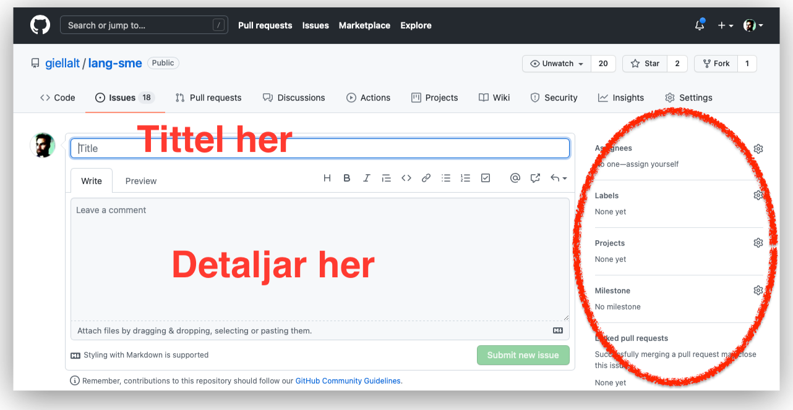
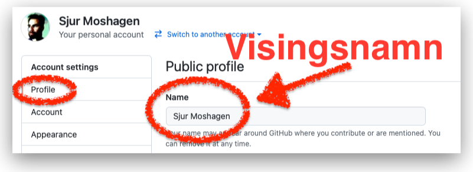

# GitHub Issues

**GitHub Issues** er eit verkty for å melda og fylgja opp feil, manglar og andre saker som må gjerast med koden. Kan òg brukast til å organisera det daglege arbeidet.

- GitHub sin eigen [dokumentasjon om issues](https://guides.github.com/features/issues/)
- formattering med [MarkDown](https://guides.github.com/features/mastering-markdown/)

## Korleis nyttar eg systemet?

### Ny melding

1. gå til repositoriet, og klikk på **Issues**, deretter på **New issue**:
   
1. Fyll i ein passande tittel, og gje detaljane i meldingsfeltet nedanfor. Du kan formattera detaljane med Markdown-syntaks. Til slutt kan du spesifisera kven som skal arbeia med saka, leggja på merkelappar m.m.
   

### Melda meir i eksisterande meldingar

1. opna ei eksisterande melding
1. skriv i tekstfeltet lengst ned:
   

## Skriva gode meldingar

- ta med alle relevante detaljar, men heller ikkje meir
- stutte og klare meldingar
- ein kan nemna folk og grupper med `@`-notasjon, då vil dei få ein e-post eller anna melding
- ein kan visa til andre feilmeldingar (*issues*) med `#xxx`-notasjon, der `xxx` er nummeret på feilmeldinga; det fungerer òg på tvers av heile GitHub-verda om ein legg til namnet på repositoriet og organisasjonen
- ein kan visa til innsjekkingar ved å nemna innsjekkings-hashen - den lange heksadesimale koden som finst for kvar innsjekking

## Korleis får eg oversikt over opne feilmeldingar

- sjå i [registeret](https://github.com/divvun/registry)
- sjå i repolista, der står det kor mange feil kvart repo har
- feilmeldingar ein sjølv har kopling til står på [github-meldingssida](https://github.com/notifications)
- det finst [ei eiga side](https://github.com/issues) for alle feilmeldingane ein har tilknyting til

# Personvern

- for å vera anonym skal ein velja eit brukarnamn som ikkje kan koplast til ein sjølv
    - det er mogleg å byta brukarnamn [her](https://github.com/settings/admin)
    - pass på å byta visingsnamn (og profilbilete!) med det same:
      
    - om ein byter brukarnamn så vil [nokre referansar til det gamle brukarnamnet ikkje lenger fungera](https://docs.github.com/en/account-and-profile/setting-up-and-managing-your-github-user-account/managing-user-account-settings/changing-your-github-username)
- la e-postadressa di [vera privat](https://github.com/settings/emails) — «**Keep my email addresses private**»
- la andre innstillingar vera standard
- ein kan gjera repositorium private om det trengst
