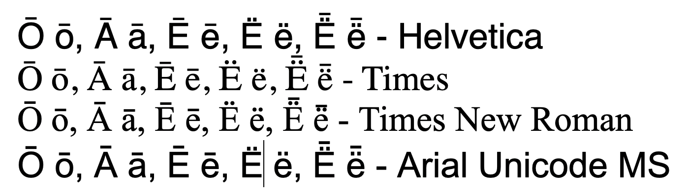
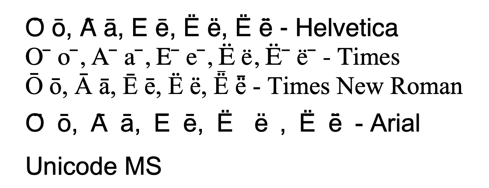
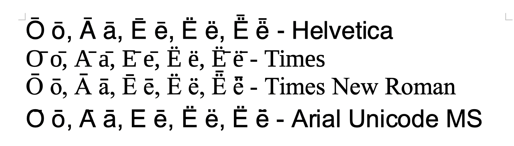
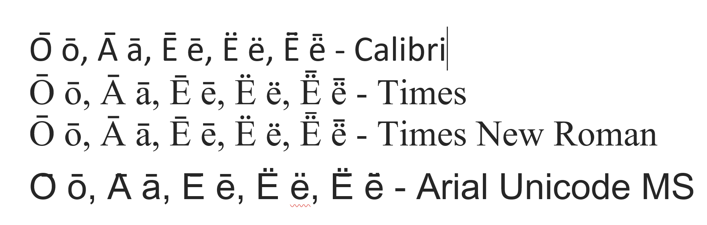
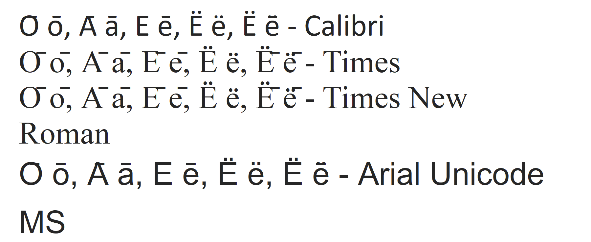

# Unicode pain points

**TLDR:** Make sure that the surface side of fst's do not contain any multichars, only sequences of individual code points, also in the case of combining diacritics. Exception: spellers. Details below.

# Combining diacritics background

Many minority and indigenous languages have orthographies that use various diacritics to mark features like length, tone, nasalisation and more. But unlike the majority languages, quite often the combination of base character and diacritic(s) is not available in Unicode as a precomposed combo, and instead one has to use the fallback mechanism of combining diacritics. While nice on paper, it leads to various issues that only arise for these languages, the most relevant for our work are:

- ambiguous tokenisation of input strings
- unreadable rendering of texts

# Tokenisation and text analysis

When working with the lexicon and phonological rules, it is natural to either implicitly or explicitly treat sequences of base characters and combining diacritics as one entity, preferably explicitly defined as a multichar symbol in `lexc`, and in the alphabet section in `twolc` files (in xfst rewrite rules such symbols tend to be more implicilty defined).

As part of the internal processing and rule writing, this is fine. But for the final analysers it can be problematic. Using `hfst-lookup`, it works fine, and the tool will parse the input string either way (as multichars or individual symbols) in accordance with the fst. But when using `hfst-tokenise`, this does not work: the tool assumes a sequence of code point characters. There has been an attempt at working around this restriction, but in the end the simplest solution is to ensure that all multichars on the surface side of an fst are expanded into individual character symbols. For consistency's sake, and to avoid issues separating lemma letters from multichar tags in `hfst-tokenise`, it should be done on both sides of the fst.

## The regex

To ensure that this is done consistently for all fst's, this is best done as the last processing step of the `raw` fst. Here's an example from [`lang-lut/src/orthography/split-composed-chars.regex`](https://github.com/giellalt/lang-lut/):

```
# Regex to expand multichar symbols (in the fst sense) to a string of
# individual letters. Will make sure that various tools do not choke
# on parsing input strings.

"b̓"  -> {b̓} ,
"c̓"  -> {c̓} ,
"dᶻ" -> {dᶻ},
"gʷ" -> {gʷ},
"kʷ" -> {kʷ},
"k̓"  -> {k̓} ,
"k̓ʷ" -> {k̓ʷ},
"l̕"  -> {l̕} ,
"m̓"  -> {m̓} ,
"n̓"  -> {n̓} ,
"p̓"  -> {p̓} ,
"qʷ" -> {qʷ},
"q̓"  -> {q̓} ,
"q̓ʷ" -> {q̓ʷ},
"t̕"  -> {t̕} ,
"w̓"  -> {w̓} ,
"xʷ" -> {xʷ},
"x̌"  -> {x̌} ,
"x̌ʷ" -> {x̌ʷ},
"y̓"  -> {y̓} ,
"č̓"  -> {č̓} ,
"ƛ̕"  -> {ƛ̕} ,
"ə́"  -> {ə́} ;
```

## The build rule

Then in the `src/Makefile.am` file:

```make
### Split multichar letters early, to avoid repetitive code. ###
### Multichar letters must be split on both sides, and then  ###
### the alphabet pruned, for hfst-tokenise to work without   ###
### issues.                                                  ###
generator-raw-gt-desc.hfst: generator-raw-gt-desc.tmp.hfst \
	         orthography/split-composed-chars.compose.hfst
	$(AM_V_XFST_TOOL)$(PRINTF) "read regex            \
	        @\"orthography/split-composed-chars.compose.hfst\".i \
	    .o. @\"$<\"                               \
	    .o. @\"orthography/split-composed-chars.compose.hfst\" \
	    ;\n\
	 save stack $@.tmp\n\
	 quit\n" | $(XFST_TOOL)
	 $(AM_V_HPRUNE)$(HFST_PRUNE_ALPHABET) -i $@.tmp -o $@
	 $(AM_V_at)rm -f $@.tmp

# Xfst and Foma version:
analyser-raw-gt-desc.%: analyser-raw-gt-desc.tmp.% \
	         orthography/split-composed-chars.compose.%
	$(AM_V_XFST_TOOL)$(PRINTF) "read regex            \
	        @\"orthography/split-composed-chars.compose.$*\".i \
	    .o. @\"$<\"                               \
	    .o. @\"orthography/split-composed-chars.compose.$*\" \
	    ;\n\
	 save stack $@\n\
	 quit\n" | $(XFST_TOOL)
```

# Spellers

When working with spellers, the main concern is very different from that of text
tokenisation: we want to modell and correct spelling errors, and to keep a sane
mind, it is important to make sure that fst "letters" are the same as our mental
"letters". That is, we want sequences of base characters and combining diacritics
to be encoded as multichar symbols in the fst, so that we can manipulate them
as single entities.

## The regex

Since this only concerns spellers, we device a regex to revert the operation
above, for spellers only. Here is another example from `lang-lut/tools/spellcheckers/filters/join-composed-chars.regex`:

```
# Regex to turn a string of individual letters including combining diacritics
# into multichar symbols (in the fst sense).
# Needed to stay sane when working with speller error models.

{b̓}  -> "b̓" ,
{c̓}  -> "c̓" ,
{dᶻ} -> "dᶻ",
{gʷ} -> "gʷ",
{kʷ} -> "kʷ",
{k̓}  -> "k̓" ,
{k̓ʷ} -> "k̓ʷ",
{l̕}  -> "l̕" ,
{m̓}  -> "m̓" ,
{n̓}  -> "n̓" ,
{p̓}  -> "p̓" ,
{qʷ} -> "qʷ",
{q̓}  -> "q̓" ,
{q̓ʷ} -> "q̓ʷ",
{t̕}  -> "t̕" ,
{w̓}  -> "w̓" ,
{xʷ} -> "xʷ",
{x̌}  -> "x̌" ,
{x̌ʷ} -> "x̌ʷ",
{y̓}  -> "y̓" ,
{č̓}  -> "č̓" ,
{ƛ̕}  -> "ƛ̕" ,
{ə́}  -> "ə́" ;
```

## The build rule

To make use of the regex, add something like the following to
`tools/spellcheckers/Makefile.mod-spellcheckers.am`:

```make
# To be able to stay sane while working with spellers, error models, etc
# we convert back combining diacritic sequences to multichars, so that the
# mental letters are single fst symbols and not several. For consistensy's
# sake we do the same on the lemma side.
generator-speller-gt-norm.%: generator-speller-gt-norm.tmp.% \
	                    filters/join-composed-chars.hfst
	$(AM_V_XFST_TOOL)$(PRINTF) "read regex            \
	            @\"filters/join-composed-chars.hfst\".i \
	        .o. @\"$<\"                                 \
	        .o. @\"filters/join-composed-chars.hfst\"   \
	        ;\n\
	     save stack $@.tmp\n\
	     quit\n" | $(XFST_TOOL)
	     $(AM_V_HPRUNE)$(HFST_PRUNE_ALPHABET) -i $@.tmp -o $@
	     $(AM_V_at)rm -f $@.tmp
```

Given this, a letter in the common sense will also be a letter in the technical
sense, and working with the error model and correcting algorithm becomes less
frustrating.

# Text rendering

For the idea of combining diacritics to work, they need to be properly rendered. And for that the Unicode consortium has developed an algorithm that software developers are supposed to implement. And they have - sort of, and buggy. The end result is in many cases unreadable text. And this is of course an issue only hitting minority and indigenous languages, because all majority languages can use letters wth precomposed diacritics.

So what is the problem? Essentially one of (lack of) stacking, so that multiple diacritics render on top of each other or on the base character. Another issue is inconsistent implementations, so that one and the same text using exactly the same font does not render the same in different environments.

Examples can be found for many languages, below the issue is documented with Kildin Sámi letters.

The problems described here can not be solved using the GiellaLT infrastructure, that is the responsibility of system and office software developers. But documenting it with clear examples is one important step.

The test text used in the images below is as follows:

```
О̄ о̄, А̄ а̄, Е̄ е̄, Ё ё, Ё̄ ё̄ - Calibri
О̄ о̄, А̄ а̄, Е̄ е̄, Ё ё, Ё̄ ё̄ - Palatino
О̄ о̄, А̄ а̄, Е̄ е̄, Ё ё, Ё̄ ё̄ - Times New Roman
О̄ о̄, А̄ а̄, Е̄ е̄, Ё ё, Ё̄ ё̄ - Arial Unicode MS
```

The macron is a combining diacritic, the diaeresis is precomposed. All base characters are Cyrillic. None of these letters exist as precomposed, so using a combining diacritic macron is the only option.

All screen shots below were taken September 7, 2021.

## Pages, macOS 11


Most things look good, although the macron on top of the diaeresis in Times New Roman is a bit close. Otherwise fine. This app is probably using the default macOS font renderer, and is thus representative for most apps on the platform.

## MS Word 365, macOS


Only Times New Roman is ok, with the same issue as for Pages/macOS system renderer above. The other fonts have various strange issues:

- **Helvetica:** all macrons are rendered in the same position relative to the baseline, and overlaps with the base character or diaeresis
- **Times:** same as for Helvetica + the macron is displaced to the right
- **Arial Unicode MS:** same as for Helvetica + strange interletter spacing issues that forces the text on two lines

## LibreOffice 7, macOS


Only Times New Roman is ok, with the same issue as for Pages/macOS system renderer above. The other fonts have various strange issues:

- **Helvetica:** the macrons are rendered too close to the base character, but is otherwise fine
- **Times:** same as for Times in MS Word above, although the right displacement is not as extreme
- **Arial Unicode MS:** same as for Helvetica in MS Word above, but without the strange interletter spacing issues seen in Arial in MS Word.

## MS Word 365, Windows 10


Only Times New Roman is ok, and on Windows even the macron over the diaeresis has ok spacing. The other fonts have various strange issues:

- **Calibri** (the suggested Helvetica replacement on Windows): the macrons are rendered mostly fine above the lower case letters, but have various placement faults above the upper case ones
- **Times:** is not available on Windows, so equals Times New Roman
- **Arial Unicode MS:** same as for Helvetica in MS Word for mac above, but without the strange interletter spacing issues seen in Arial in MS Word for Mac.

## MS WordPad, Windows 10


- **Calibri:** same as for Helvetica on macOS above + horisontal offset above the Cyrillic o's
- **Times:** is not available on Windows, so equals Times New Roman (see next)
- **Times New Roiman:** all macrons are the same vertical distance from the baseline, independent of the height of the base character, and heavily displaced to the right
- **Arial Unicode MS:** same as for Calabri above

## Text rendering summary

Using a small sample of letters with a set of popular fonts, only two combinations were fully or close to fully acceptable:
* **Times New Roman in MS Word on Windows**
* **macOS default renderer, as seen in Pages**

The issue was first described about ten years ago, and the situation has not improved at all.

The fact that the macOS system renderer gets it nearly correct for all fonts shows that it is possible.
