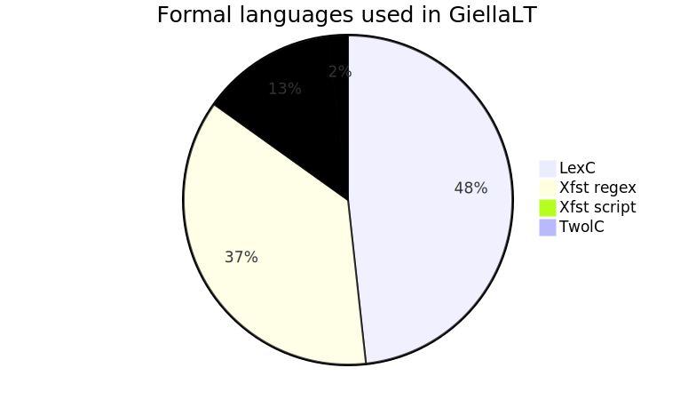
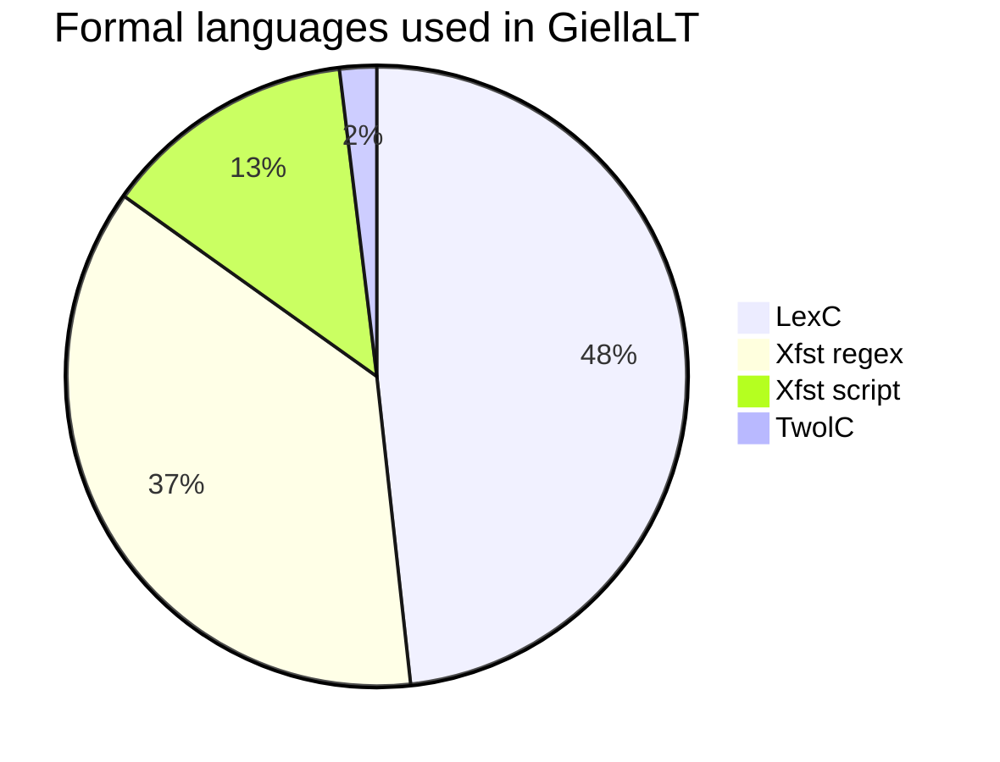

# Documentation infrastructure

# Core components

The documentation infrastructure is built on the following stones:

- [GirHub Flavoured Markdown (GFM)](https://enterprise.github.com/downloads/en/markdown-cheatsheet.pdf)
- [GitHub Pages](https://pages.github.com)
- the GH Pages theme [jekyll-theme-minimal](https://github.com/pages-themes/minimal)
- … with some modifications to create a page TOC. The TOC construction means that:
    - the first level 1 header in the document becomes the page title
    - there needs to be a second level 1 header to create a TOC

All `keyboard-xxx` and `lang-xxx` repositories (except private ones) have their
own online site as subsites of [giellalt.github.io](https://giellalt.github.io).
There are separate pages for [keyboards](/KeyboardLayouts.html) and
[language models](/LanguageModels.html) with links directly to all subsite repos.

To update the online documentation, just save Markdown files in the `docs/`
folder of the repository, commit (and if using `git`: push),
and the updated documentation will be online within a minute.

# In-source documentation in `lang-XXX` repositories

All source code in the `lang-XXX` repositories containing
[documentation markup](infraremake/In-sourceDocumentationSpecification.md) will
be automatically parsed and the documentation extracted. The extracted
documentation will be automatically added to the site on the next `svn commit`/`git push`.

Source file types being scanned for documentation comments are:

- lexc
- twolc
- cg3
- pmscript
- xfscript

The top directories `src/` and `tools/`, including all subdirs, are scanned.
*Generated* files of the above types are *not* scanned.

# Additional features

Beyond what is included in GFM, the GiellaLT documentation infrastructure also
supports [Mermaid](https://mermaid-js.github.io/) through the use of a
[GitHub Action to convert Mermaid markup to SVG](https://github.com/divvun/compile-mermaid-markdown-action).

<small>
Mermaid support has
[recently been added to GtiHub](https://github.blog/2022-02-14-include-diagrams-markdown-files-mermaid/),
but the support does not include GtiHub Pages (not yet, at least). It does cover
displaying Markdown source file views, README files, issues and discussion. By
adding Mermaid support also to our GitHub Pages sites, there is parity between
GH Pages and the rest of GitHub, and documents will render the same everywhere.
</small>

## Mermaid test

<!-- generated by mermaid compile action - START -->

  
Mermaid markup

<!-- generated by mermaid compile action - END -->

Based on counts of all files of the various types in all repositories in the
GiellaLT infra.

# Possible future improvements

- [slide support through **Sli**dev](https://sli.dev)
- [dark](https://developer.mozilla.org/en-US/docs/Web/CSS/@media/prefers-color-scheme) [mode](https://css-tricks.com/a-complete-guide-to-dark-mode-on-the-web/)
- [maps](https://docs.github.com/en/get-started/writing-on-github/working-with-advanced-formatting/creating-diagrams#creating-geojson-and-topojson-maps)
