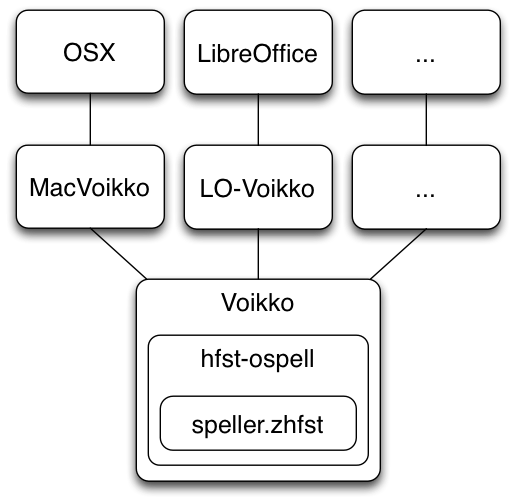
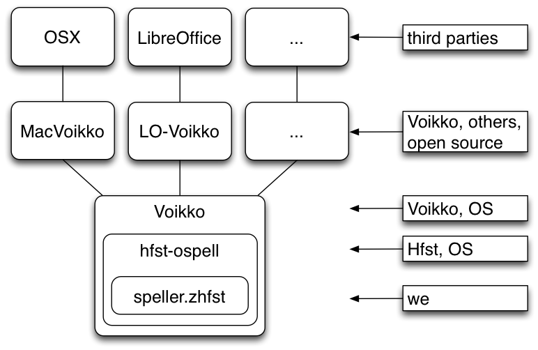

# Spellers in the GiellaLT infrastructure

Presentation at the
University of Alberta, Edmonton, June 15 2015

By: 
Sjur Moshagen, UiT The Arctic University of Norway


## Presentation Overview


* How to build a speller
* speller integration
* lexicon considerations
* suggestions - the interface of the speller
* error data
* error model
* testing


## Background


### The perfect speller


* detects all errors
* ... and only errors
* suggests the relevant correction on top - always


This tool will never exist, but it is the holy grail we work towards.


One reason it will never exist is the problem of precisely answering the
following question:


### What is a spelling error?


* not always easy to define...
* ... the simplest definition: a non-word intended to be an exising word
* this is used as the basis for most spelling checkers
* ... where word = space-separated string of letters
* more complex errors are often handled by so-called grammar checkers (although
  few of them checks your grammar in a linguistic sense)


### How to build a speller


Building an fst-based speller in the Giella framework goes like the following:


#### The acceptor


```
raw-fst
  |
  |  <- filters
  |
speller-fst (normative, without punctuation)
  |
  |  <- compounding and derivation filters, adding weights
  |
fstspeller-fst
  |
  |  <- remove the upper (analysis) side
  |
acceptor
```


#### The error model


The error model is still a bit in the flux, so the following may not hold
exactly like described in the future.


The error model is presently built from several indivual parts:


* edit distance file (edit distance 1 or 2)
* string replacement file
* word replamenent file
* possible enhancements coming up:
    * special treatment of first and last letters
    * possibility to build more complex error models using regexes or xfscripts


Each part is compiled into an fst, and unioned into one error model file.


### Speller Integration


* Components
* What Do We Control?


#### Components


Each component can add restrictions or specific behavior for the speller, and
regular maintenance is necessary as individual components are updated or
changed. Also the integration with the host OS or application may change.





#### What Do We Control?





## The Lexicon


* we want to cover the whole language
* ... but what **IS** the whole language?
* a string that is an error in one context can be desired in another, especially
  in texts on specialised topics
* another aspect is suggestions:
    * we try to suggest lexicalised compounds and derivations above dynamic ones
    * adding known compounds and derivations to the lexicon as such should thus
      be a good thing for the user
    * ... but a very big speller lexicon will be slower (this may not be a problem
      on computers, but is something to keep in mind for mobile systems)
* sometimes a correct but very rare word can cover up a common misspelling of a
  frequently used word
    * if so, it is usually best to remove the rare word from the speller
      (`+Use/-Spell`)


### Lexicon Sources


* dictionaries - but use them critically
    * they do not often contain "obvious" or productive patterns
    * rather the exceptions to the patterns
* complement dictionaries with corpus resourches as much as possible


### Restrictions On The Grammar


* an fst is a very good tool to formalise the productive patterns in a language
* but sometimes the fst can be too productive, and we get overgeneration
* this is a problem in two ways:
    * misspellings not found
    * strange suggestions
* we thus need to restrict such patterns when needed
    * compounding
    * derivations
* it is often best to use flag diacritics for this, to avoid that the fst blows
  up in size
* in the Sámi languages we use tags to describe normative compounding, and
  convert them to flag diacritics during speller compilation.


We have a similar system for derivations, based on position in a derivation
sequence.


## Suggestions - The Interface Of The Speller


Getting good and relevant suggestions is an important aspect of the speller.
Even though coverage and recall/precision numbers might be good, the users don't
care if they get strange suggestions.


On the other hand, if they get strange suggestions, it is also indicative of a
speller not able to catch all errors.


### Designing An Error Model


The infrastructure is built to automatise as much as possible, but here are some
aspects to keep in mind:


* keep the error model alphabet as small as possible, and only with letters
  you want to be used in the suggestions (don't include Þ if you don't need
  suggestions with it).
* use longer string replacements with low weights for known spelling error
  patterns
* give low weights to letters and letter pairs typical of misspellings
* use a corpus of regular text to generate frequency weights
* add positive or negative weights to specific tags to promote or demote
  some inflectional categories compared to others
