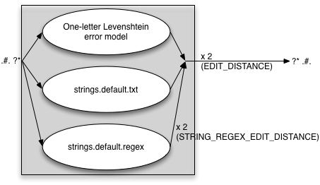

# Test-presentasjon

Dette er ei testside for Slidev-integrasjon med GiellaLT.

---

# Kva er GiellaLT?

GiellaLT tilbyr infrastruktur for regelbasert språkteknologi:

- **Minoritetsspråk**: Fokus på urfolksspråk og minoritetsspråk
- **Komplett pipeline**: Frå tastatur til talesyntese  
- **Open source**: Fritt tilgjengeleg for alle
- **Forskingsbasert**: Byggjer på fleire tiår med forsking

## Teknologiar vi støttar

- Stavekontrollar og grammatikkontrollar
- Ordbøker og nettordbøker
- Maskinomsetting
- Talesyntese og talegjenkjenning

---
layout: two-cols-header
---

# Korleis fungerer Slidev-integrasjonen?

::left::

## Automatisk generering

1. **Markdown-filer** blir automatisk oppdaga
2. **Lenker** som sluttar på `-slidev/` triggar bygging
3. **GitHub Actions** byggjer presentasjonane
4. **Jekyll** publiserer dei som statiske filer

::right::

## Fordelar

- ✅ Enkelt å lage presentasjonar frå dokumentasjon
- ✅ Versjonskontroll av presentasjonsinnhald
- ✅ Automatisk publisering til nettet
- ✅ Responsive design som fungerer på alle einingar

---

# Kodedøme

```javascript
// Enkel funksjon for å vise korleis kode ser ut i Slidev
function greetLanguages() {
    const languages = ['sme', 'smj', 'sma', 'fin', 'nob'];
    languages.forEach(lang => {
        console.log(`Bures boahtti ${lang} teknologiija!`);
    });
}
```

---

# Bilete



---
layout: image-right
image: ../images/ErrorModelWithBoth.png
backgroundSize: 30em 50%
---

# Error models

- test
- error models
- spellers and suggestions

---
layout: center
---

# Slide 2

A page with the layout `center`.

---

# Test med bilete i ein lokal underkatalog


---
layout: end
---

Giitu!

Gijto!

Gæjtoe!
