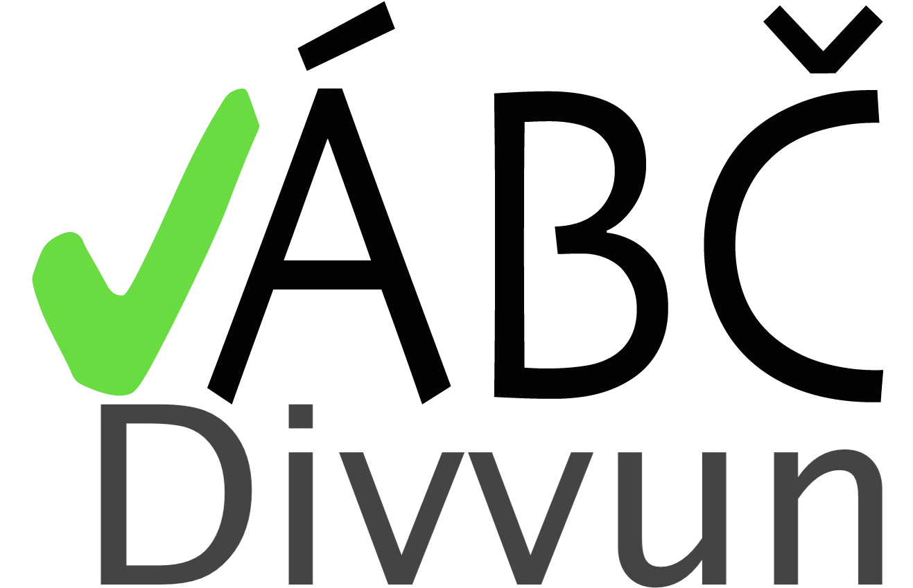
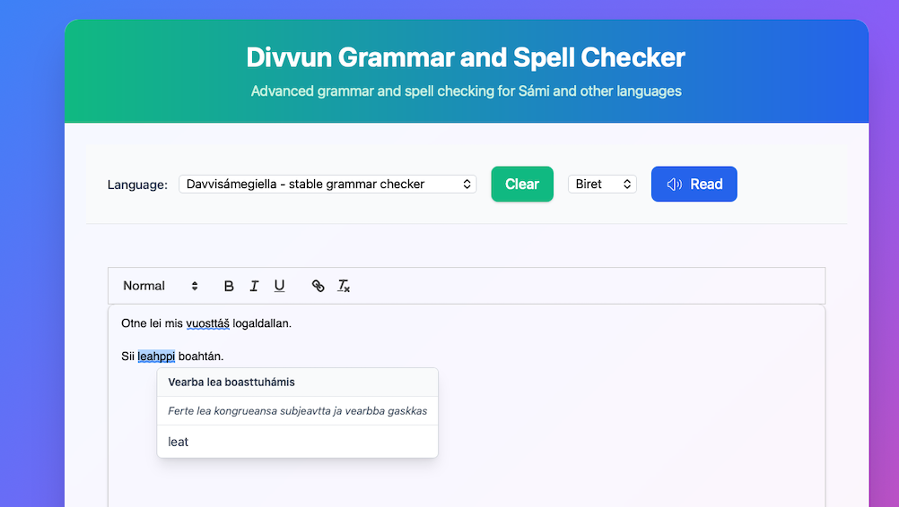
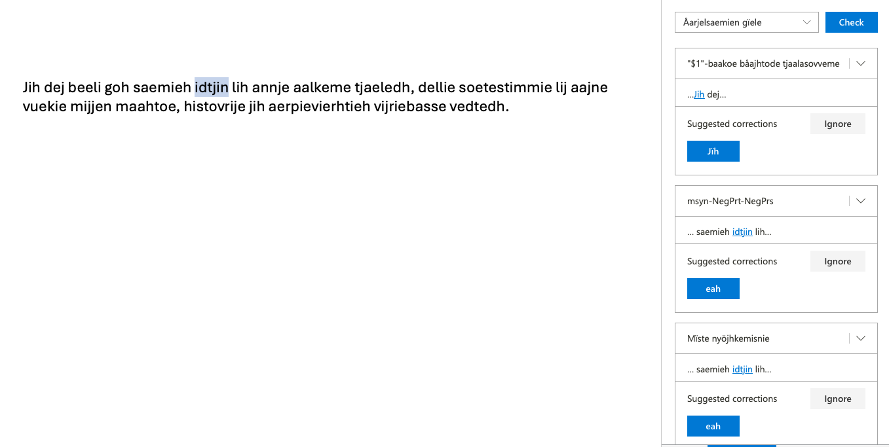
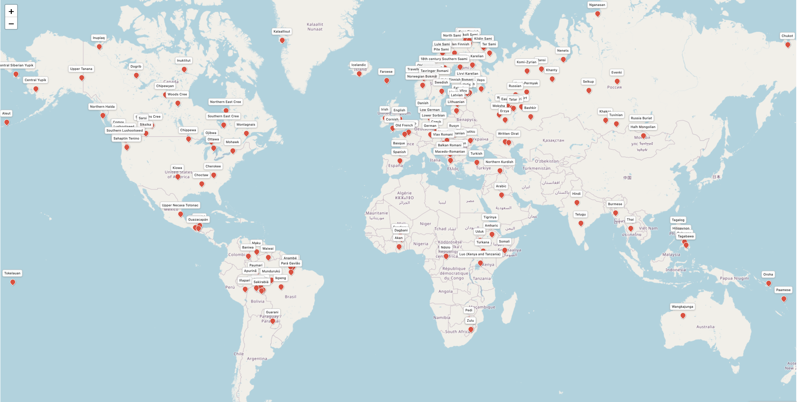

# Divvun-gruppa ved ISK

---

## Divvun

 

Actio av verbet `divvut` == `å reparera`

Samarbeid med Giellatekno heilt sidan starten.

Starta ved Sametinget hausten 2004.

Flytta til UiT og vart ein del av ISK 1.7.2011.

---

## Heile gruppa

 

- Børre Gaup
- Flammie Pirinen
- Helena Omma
- Inga Mikkelsen
- Katri Hiovain-Asikainen
- Linda Wiechetek
- Maja Lisa Kappfjell
- Sjur Nørstebø Moshagen

---

## Kva vi gjer

 

- språteknologi for samisk
- basert på grammatikk
- for dei samiske språksamfunna
- internasjonalt samarbeid med andre urfolk og språklege minoritetar

---

## Børre Gaup

 

- har vært med siden prosjektet ble startet opp i 2004
- [tekstkorpus](https://gtweb.uit.no/korp/)
- Giellagáldus termwiki
- [elektroniske ordbøker m/talesyntese](https://sátni.org/grønnkål)
- [grammatikkontroll m/integrert stavekontroll + talesyntese](https://divvun.uit.no)

---

::image[images/make-check.png]{class="mx-auto"}

## Flammie Pirinen

 

* vokst opp i 🇫🇮Finland
* har studert i Universitet i ❄️Joensuu (informatik BSc, Finsk lingvistik),
  Universitet i 🌧️Helsingfors (språkteknologi Msc og Phd)
* Postdoc i 🇮🇪DCU (Dublin) og 🇩🇪UHH (Hamburg)
* jobbet i divvun 🇳🇴 siden 2020 mest med programmering og sånt
* norsk er ca 6.–7. språk ä har lärt meg

---

## Helena Omma

 

- nordsamisk lingvist
- grammatikkontroll
- byrja ved UiT og Divvun-gruppa i august

---

## Inga Mikkelsen

 

- lulesamisk lingvist
- grammatikkontroll
- talesyntese
- for tida frikjøpt frå gruppa for å jobba med doktorgraden sin

---

## Katri Hiovain-Asikainen

 

- fra Finland og Estland
- studert samisk i Helsinki Universitet
- PhD i fonetikk og taleteknologi, avhandling om nordsamisk fonetikk
- jobbet med samisk taleteknologi ca. 10 år i Helsinki og Tromsø, i Divvun 5 år
- Er ansvarlig for taleteknologi i Divvun og vi har produsert talesyntese for nord-, lule- og sørsamisk og jobber nå med enaresamisk og karelsk, også arbeid med talegjenkjenning

---

## Linda Wiechetek

---

---

## Maja Lisa Kappfjell

 

- Gaebpien Maajja Læjsa, Voengel Njaarke sïjteste // Maja Lisa Kappfjell - fra Maajehjaevrie/Majavatn i Sør-Helgeland.
- Mastergrad i sørsamisk språkvitenskap fra UiT, UiT Norges Arktiske Universitet, fra 2010: «Åarjelsaemien attribuhte-predikatijve systeeme».
- Overingeniør ved Divvun/UiT
- Har vært med i utviklingen av grammatiske språkmodeller for sørsamisk siden 2009.

---

## Sjur Nørstebø Moshagen

 

- nordisk, lingvistikk og programmering som grunnutdanning
- har arbeidd med datalingvistikk og språkteknologi i over 30 år
- samisk språkteknologi nesten like lenge
- har arbeidd for to ulike firma som har levert norske korrekturverktøy til MS
- er ein av to hovudarkitektar bak noverande infrastruktur for samisk språkteknologi
- har leidd Divvun-gruppa sidan starten for 21 år sidan

---
layout: two-cols-header
---

## Verktøya vi lagar

 

::left::

- mobiltastatur med stavekontroll
- datamaskintastatur
- [stavekontroll](https://divvun.uit.no)
- [grammatikkontroll m/integrert stavekontroll](https://divvun.uit.no)
- [elektroniske ordbøker](https://satni.org)
- maskinomsetjing
- omsetjingsminne
- [tekstkorpus](https://gtweb.uit.no/korp/)
- [talesyntese](https://borealium.org/nn/category/text-to-speech/)
- talegjenkjenning (eksperiment)

::right::

For desse systema:

- Android
- iOS
- macOS
- Windows
- Linux
- ChromeOS

---

## Alle språka i repoa våre

---

## Oppsummering

 

- lita men allsidig gruppe
- dekkjer mange språk, både samiske og andre
- gjer veldig mykje forskjellig
- eksternt finansiert av KDD
- har mykje samarbeid med andre institusjonar og folk, i Noreg og utanfor
- fokus på *verktøy* til det samiske samfunnet
- men gjer i praksis mykje forsking òg, for å kunna levera slike verktøy
