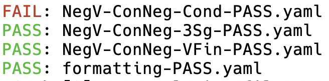
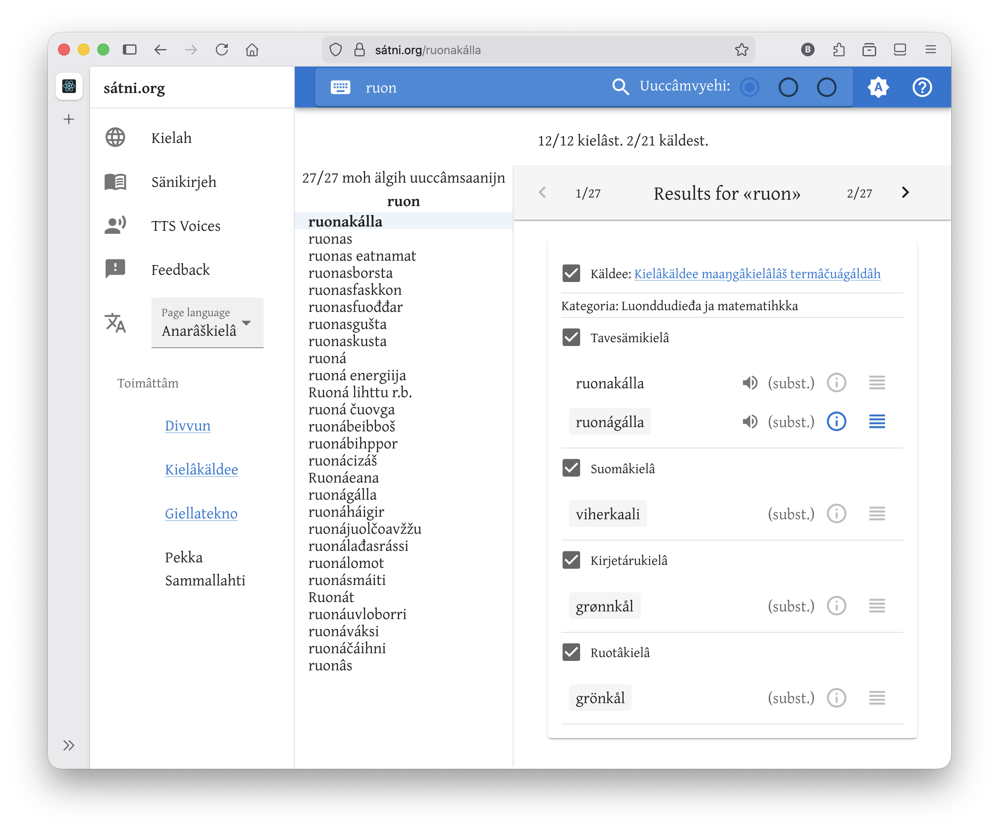
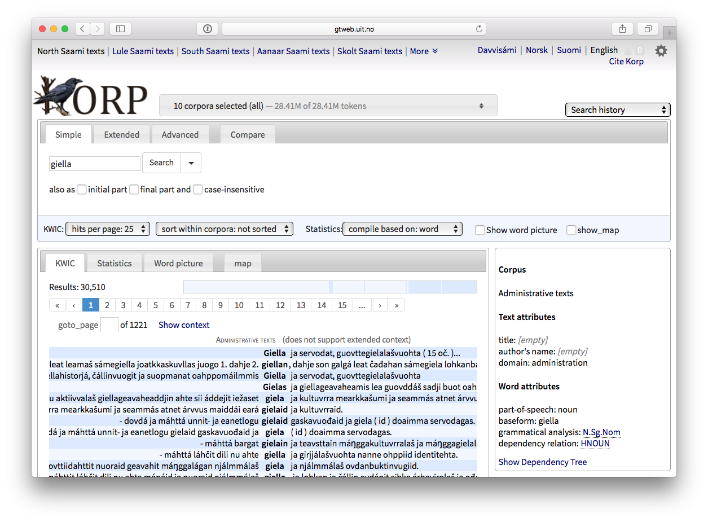

# Divvun-gruppa ved ISK

---

## Heile gruppa

- Børre Gaup
- Flammie Pirinen
- Helena Omma
- Inga Mikkelsen
- Katri Hiovain-Asikainen
- Linda Wiechetek
- Maja Lisa Kappfjell
- Sjur Nørstebø Moshagen

---

## Divvun

- Actio av `divvut` (verb)
- `divvut` betyr å reparera

---

## Kva vi gjer

- språteknologi for samisk
- basert på grammatikk
- for dei samiske språksamfunna
- internasjonalt samarbeid med andre urfolk og minoritetsspråk

---

## Børre Gaup

### jobb

- jobbet siden november 2004

---

---

---

---

---

## Flammie Pirinen

---

## Helena Omma

---

## Inga Mikkelsen

---

## Katri Hiovain-Asikainen

- fra Finland og Estland
- studert samisk i Helsinki Universitet
- PhD i fonetikk og taleteknologi, avhandling om nordsamisk fonetikk
- jobbet med samisk taleteknologi ca. 10 år i Helsinki og Tromsø, i Divvun 5 år
- Er ansvarlig for taleteknologi i Divvun og vi har produsert talesyntese for nord-, lule og sørsamisk og jobber nå med enaresamisk og karelsk, også arbeid med talegjenkjenning

---

## Linda Wiechetek

---

---

## Maja Lisa Kappfjell

 Jeg er Gaebpien Maajja Læjsa/ Maja Lisa Kappfjell fra Maajehjaevrie/Majavatn, Voengel Njaarke sïjteste 
- Sørsamisk lingvist v/ Divvun siden 2009
- Sørsamisk fra Nord Universitet,  Informatikk fra NTNU Trondheim,  sørsamisk mellomfag, PPU og masteravhandling i sørsamisk fra 2010 v/ UiT
- Har vært med å utvikle stavekontroll, 

---

## Sjur Nørstebø Moshagen

- nordisk, lingvistikk og programmering som grunnutdanning
- arbeidd med datalingvistikk og språkteknologi i over 30 år
- samisk språkteknologi nesten like lenge
- arbeidd for to ulike firma som har levert norske korrekturverktøy til MS
- er ein av to hovudarkitektar bak noverande infrastruktur for samisk språkteknologi
- har leidd Divvun-gruppa sidan starten for 21 år sidan

---

---

## Oppsummering

- lita men allsidig gruppe
- dekkjer mange språk, både samiske og andre
- gjer veldig mykje forskjellig
- eksternt finansiert av KDD
- har mykje samarbeid med andre institusjonar og folk, i Noreg og utanfor
- fokus på verktøy til det samiske samfunnet
- men gjer i praksis mykje forsking òg, for å kunna levera slike verktøy
