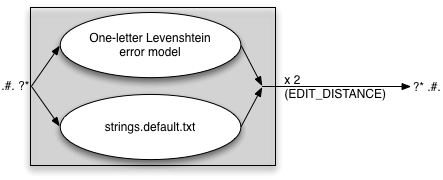
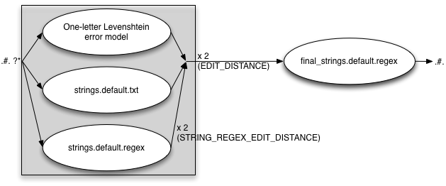

# The Speller Error Model

This document describes the different parts of the error model used to create
suggestions for the spellers, how they interact, and how one can turn the
different parts on and off.


# Makefile configurations


The file `tools/spellcheckers/Makefile.mod-desktop-hfst.am` looks like
this, with default values as given by the `und/` template (there is a corresponding file for mobile phone spellers, so that they can be made different from the desktop spellers):


```make
# This is the default weight for all editing operations in the error model:
DEFAULT_WEIGHT=10


# Edit distanse for the Levenshtein error model:
EDIT_DISTANCE=2


# Define whether we allow changes to the initial letter(s) in the error model,
# possible values are:
# * no    - no longer string edits = only the default, letter-based error model
# * txt   - use only the txt file as source
# * regex - use only the regex file as source
# * both  - use both the txt and regex files as sources
# NB!!! Setting this to anything but 'no' will greatly increase the size and
# search space of the error model, and thus make it much, much slower. Make sure
# you TEST the resulting error model properly and thoroughly, both for speed
# and suggestion quality.
INITIAL_EDITS=no


# Variable to define whether to enable edits of longer strings (as opposed to
# single letters). Possible values are:
# * no    - no longer string edits = only the default, letter-based error model
# * txt   - use only the txt file as source
# * regex - use only the regex file as source
# * both  - use both the txt and regex files as sources
STRING_EDITS=txt
# Variable to specify the edit distance for the regex
# version of the strings file. The total edit distance for those operations is
# this value multiplied with the value of the DEFAULT_EDIT_DIST variable.
STRING_REGEX_EDIT_DISTANCE=2


# Variable to define whether to enable edits of word-final strings (as opposed
# to single letters). Possible values are:
# * no    - no longer string edits = only the default, letter-based error model
# * txt   - use only the txt file as source
# * regex - use only the regex file as source
# * both  - use both the txt and regex files as sources
FINAL_STRING_EDITS=no


# Variable to define whether to enable whole-word replacements. Possible values:
# - yes
# - no
WORD_REPLACEMENTS=no
```


The different options are described above in the comments. In the following
discussion only the relevant options are listed. We'll start with a minimal
error model:


# A minimal error model


```make
DEFAULT_WEIGHT=10
EDIT_DISTANCE=2
INITIAL_EDITS=no
STRING_EDITS=no
FINAL_STRING_EDITS=no
WORD_REPLACEMENTS=no
```


That is, the error model contains only a Levenshtein edit distance `2` error
model with no additional components. It can be illustrated like this (the
multiplication factor `2` is taken from the `Makefile.am` variable
`EDIT_DISTANCE`, and `.#.` marks the beginning and end of the word):


(Strictly speaking, the error model could have been even simpler, by specifying
an edit distance of one. But that will in most cases produce a very bad speller,
so we stick to the default editing distance 2 default value.)


The file used to specify the letters of the error model is:


```sh
tools/spellcheckers/editdist.default.txt
```


In that file you specify the whole alphabet used for the error model (that is,
all and only the letters you want to be used when generating correction
suggestions). The default weight for each modification of the input misspelling
is specified in the `Makefile.am` variable:


```make
DEFAULT_WEIGHT=10
```


That is, every letter change is given a default weight of `10` (in addition
to whatever weight is already present, e.g. from the corpus).


One can change this default for individual letters in the alphabet in the
`editdist.default.txt` file (which will then change the weight for all pairs
involving that letter), or for specific transitions:


```
## Inclusions: this is the real alphabet definition:
a
á	5
b
c
č	6


## Transition pairs + weight - section separator:
@@


## Transition pair specifications:
a	á	4
á	a	4
```


In the above fragment, the letters `a`, `b` and `c` will have a default
weight of `10` for all changes involving these letters, whereas changes
involving `á` and `č` will have a non-default weight as specified. In
addition, the change from `a` to `á` (and the other way around) is given a
weight of `4`.


# Slightly more complex - adding STRING_EDITS


The `STRING_EDITS` variable governs whether longer stretches than single
characters (ie strings) can be changed in one editing operation. It has four
possible values:


* ***no***:  no `STRING_EDITS` operations
* ***txt***:  `STRING_EDITS` taken from a txt file
* ***regex***:  `STRING_EDITS` taken from a regex file
* ***both***:  `STRING_EDITS` taken from both a txt and a regex file


## STRING_EDITS=txt


Using a txt file as the input file for `STRING_EDITS` operations, you edit
a very simple data structure:


```
gi:giija	-2
riikka:rihká	-2
rg:rgg	-2
rgg:rg	-2
```


The format is:


* input string
* colon
* output string to replace the input string
* TAB
* weight specification (numeric type *real*)


The intended use is to replace sequences of characters that typically get
spelled wrongly with their correct counterpart, such that the expected
suggestions appear on top or among the top 5. This can be useful also in cases
where the actual editing distance between input and output is only one, e.g.
when the error is part of a regular but context-restricted pattern.


The filename for this file is: `strings.default.txt`. The `default` part
can be replaced with names for alternative writing systems or orthographies, to
be used in spellers for those writing systems or orthographies.


The string pairs in this file is compiled in as a parallel fst to the
Levenshtein edit distance model, and the editing distance variable is applied to
both. That is, with the following setup:

```make
EDIT_DISTANCE=2
STRING_EDITS=txt
```

we get an error model that can be illustrated as follows:



`EDIT_DISTANCE=2` means that one can correct up to two errors in the input
word, each of which can be either a regular Levenshtein operation or a string
replacement operation.


## STRING_EDITS=regex


The file for the regex string editing model is: `strings.default.regex`. The
content of that file is a standard Xerox-style regular expression, with an
additional Hfst weight specification:


```
{øø} -> {öö}::0 ,
 ø   ->  {ö}::0 ;
```


With the Makefile.am variables set as follows:

```make
EDIT_DISTANCE=2
STRING_EDITS=regex
STRING_REGEX_EDIT_DISTANCE=2
```

we get an error model that looks like:


The variable `STRING_REGEX_EDIT_DISTANCE` regulates how many times the regex
file is applied - **on top of** the EDIT_DISTANCE variable. With the values
specified above, you can have *four* changes applied to the input word, as
long as all changes are covered by the `strings.default.regex` error model.

## STRING_EDITS=both

In this case both the `txt` and `regex` files are included. With the
following settings:

```make
EDIT_DISTANCE=2
STRING_EDITS=both
STRING_REGEX_EDIT_DISTANCE=2
```

we get the following error model:


Beware that when using both the txt and the regex strings extensions to the
Levenshtein model, there is a risk that the total error model becomes too large
and powerful. This will be noticable through sluggish suggestion speed. To avoid
this issue, make sure you only include strings and string patterns that are
frequent and have a good effect on suggestion quality. Also have a look at the
error model file size.

# Increasing the complexity - adding FINAL_STRING_EDITS

This part of the error model is meant to cover errors in suffixes. It comes
*in addition to* the previous Levenshtein + strings error model, which means that with `EDIT_DISTANCE=2`, you get two edit operations (Levenshtein or string) *pluss* one suffix operation. This will normally not be a problem since the changes are restricted to the final parts of the word, and thus the search space for the error model does not increase very much.


The possible values for this variable are the same as for `STRING_EDITS`:


* ***no***:  no `FINAL_STRING_EDITS` operations
* ***txt***:  `FINAL_STRING_EDITS` taken from a txt file
* ***regex***:  `FINAL_STRING_EDITS` taken from a regex file
* ***both***:  `FINAL_STRING_EDITS` taken from both a txt and a regex file


Each of these values has the same meaning and consequence as for
`STRING_EDITS`. The files are named `final_strings.default.*`.


## FINAL_STRING_EDITS=txt


```make
EDIT_DISTANCE=2
STRING_EDITS=both
STRING_REGEX_EDIT_DISTANCE=2
FINAL_STRING_EDITS=txt
```


## FINAL_STRING_EDITS=regex


```make
EDIT_DISTANCE=2
STRING_EDITS=both
STRING_REGEX_EDIT_DISTANCE=2
FINAL_STRING_EDITS=regex
```





## FINAL_STRING_EDITS=both


```make
EDIT_DISTANCE=2
STRING_EDITS=both
STRING_REGEX_EDIT_DISTANCE=2
FINAL_STRING_EDITS=both
```


The same warning applies in this case as with the `STRING_EDITS` — if you use
both the `txt` and the `regex` files, make sure to test for speed and size
issues.


# Maximum complexity - adding INITIAL_EDITS


**NB!** This is an experimental feature, and is not guaranteed to work as
intended.


The purpose of this variable is to allow for special treatment of the initial
letter(s) of the misspellings. This has a huge price, though, in terms of search
space and thus speed of the speller. If enabled, consider redusing the editing
distance to one, and compensate with more targeted additions in the `strings`
and `final_strings` files.


Also, as seen below, these edit operations come *in addition to* the regular
Levenshtein model (and final_strings operations), which means that the effective
editing distance of an error model with `INITIAL_EDITS` on,
`EDIT_DISTANCE=2` and `FINAL_STRING_EDITS` enabled is **four**. That is a
very powerful model, and one that is likely to be way too slow. Reducing
`EDIT_DISTANCE` to `1` will substantially limit the error model, and thus
improve suggestion speed.


The possible values for the `INITIAL_EDITS` variable are:


* ***no***:  no `INITIAL_EDITS` operations
* ***txt***:  `INITIAL_EDITS` taken from a txt file
* ***regex***:  `INITIAL_EDITS` taken from a regex file
* ***both***:  `INITIAL_EDITS` taken from both a txt and a regex file


Each of these values has the same meaning and consequence as for
`STRING_EDITS`. The files to edit are `initial_letters.default.*`.


## INITIAL_EDITS=txt


```make
EDIT_DISTANCE=2
INITIAL_EDITS=txt
STRING_EDITS=both
STRING_REGEX_EDIT_DISTANCE=2
FINAL_STRING_EDITS=both
```


## INITIAL_EDITS=regex


```make
EDIT_DISTANCE=2
INITIAL_EDITS=regex
STRING_EDITS=both
STRING_REGEX_EDIT_DISTANCE=2
FINAL_STRING_EDITS=both
```


## INITIAL_EDITS=both


```make
EDIT_DISTANCE=2
INITIAL_EDITS=both
STRING_EDITS=both
STRING_REGEX_EDIT_DISTANCE=2
FINAL_STRING_EDITS=both
```


# Complete madness - adding WORD_REPLACEMENTS


Actually, that might not be a bad idea. Enabling `WORD_REPLACEMENTS` does not
really add to the complexity of the error model, but it allows targeted
promotion of individual words on the suggestion list, words with known and
frequent misspellings. To that end you can add misspelled words and their
corrections to the file `words.default.txt`, in the following format:


```
oahppiin:ohppiin	-10
váiloje:váilo	-10
maŋge:mange	-10
```


The format is:
* misspelled word
* colon
* correct word
* TAB
* weight


The possible values for the `WORD_REPLACEMENTS` variable are:


* ***no***:  no `WORD_REPLACEMENTS` operations
* ***yes***:  enable `WORD_REPLACEMENTS`


Expanding on the settings fragment used throughout, we get the following:


```make
EDIT_DISTANCE=2
INITIAL_EDITS=both
STRING_EDITS=both
STRING_REGEX_EDIT_DISTANCE=2
FINAL_STRING_EDITS=both
WORD_REPLACEMENTS=yes
```


When enabled, the file is compiled into an fst that is applied outside the rest
of the error model:


As discussed next, the settings above are not a good idea. The maximum editing
distance is actually six (`6! - 1 + (2*2) + 1`), which is way too much. But
it serves to illustrate the use of the settings in `Makefile.am`.


# Final words


DO NOT ENABLE EVERYTHING! That will very, very likely make the error model size
explode, and make the speller so slow that it can't be used. Exactly which files
and what features are needed will vary from language to language, and has to be
tested on a case by case basis.


The goal of a good speller is to always suggest the correct thing, or something
sensible and close to the correct thing, but do not try to overdo this - it is
better to not suggest something, than to need several seconds to be able to
suggest.
