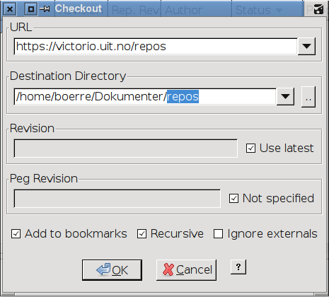
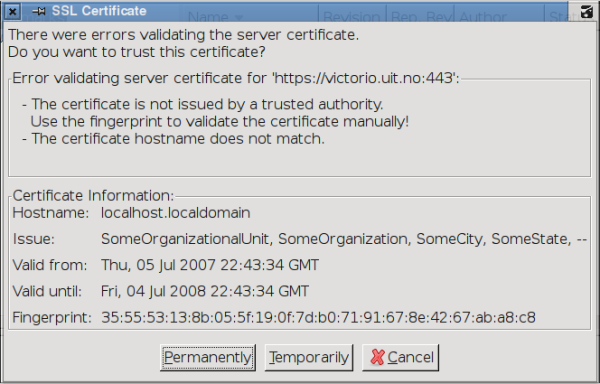
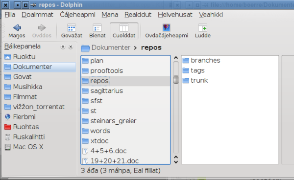

Basic usage
===========

Choose Repository-&gt;Checkout...

Write `https://gtsvn.uit.no/langtech/trunk` into the URL box. Choose the
folder where you would like to place the files in the Destination
Directory box (we suggest adding **langtech** to the end of the path, to
keep svn folders in a separate place), then press OK.

Press "Permanently" when the SSL Certificate dialog appears.

Working with the repository
===========================

In the directory that you did the checkout you will now have a directory
called `langtech` where all our code is contained. Usually the daily
work goes on in the `repos/trunk` directory.

