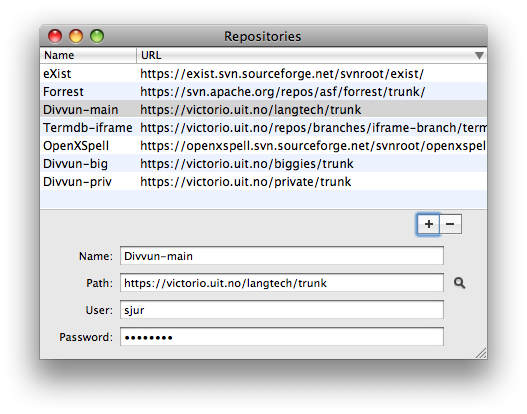
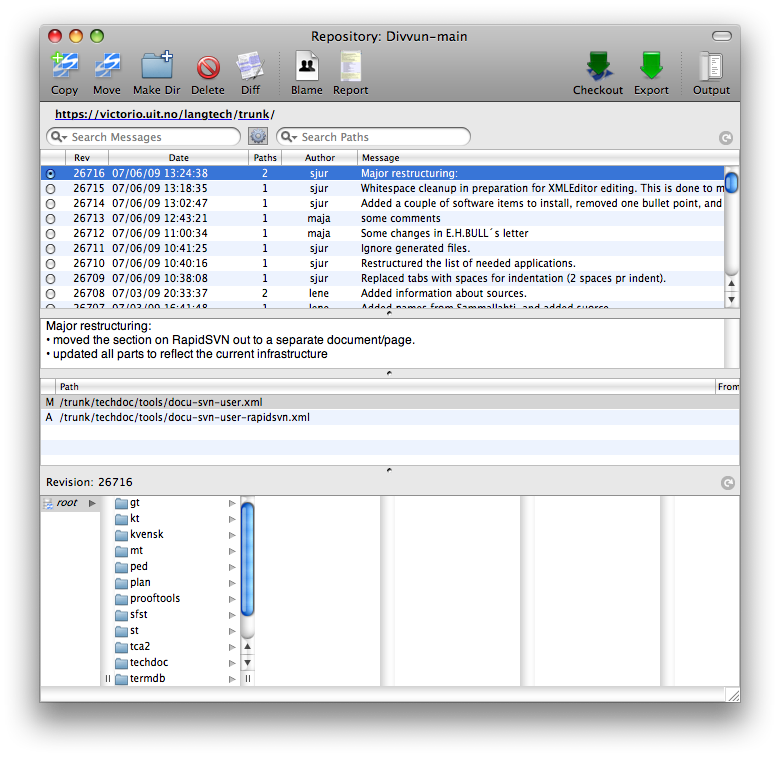
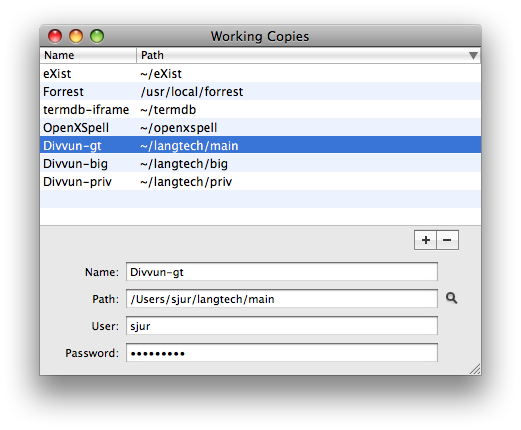
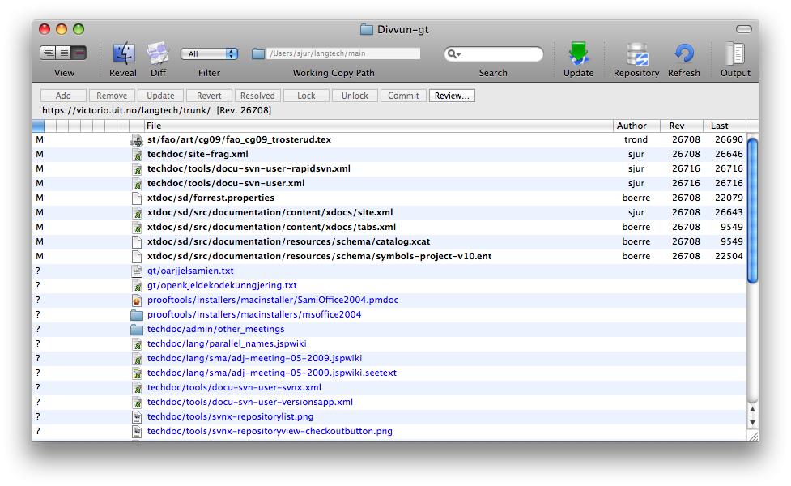
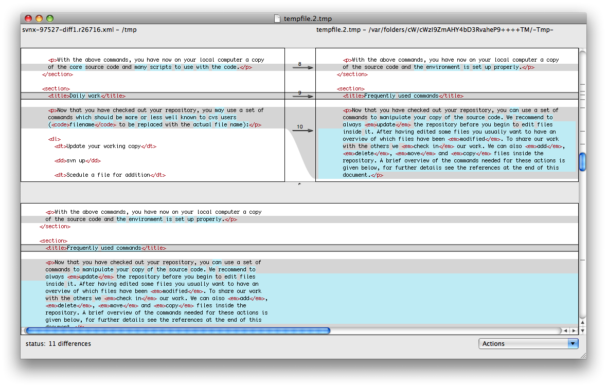

Initial setup and checkout
==========================

Open the repository window (**Window &gt; Repository**), and fill in the
details for our repository:  

Double-click the repository entry you just made (see picture above). In
the new window that opens, click on the button **Checkout**:  

If you already have checked out (e.g. on the command line), just fill in
the details directly in the **Working Copies** window (see below).

Working with the local source code
==================================

In the directory that you did the checkout in, you will now have a
directory called `langtech` where all our code is contained. The whole
working copy is listed in the Working Copies window (**Windows &gt;
Working Copies**):  

Double click the corresponding line, and you will get a window listing
the current state of your working copy:  

Highlight a file  
  
and click **Diff** to get a visual presentation of your modifications
compared to the untouched version:  

Click the **Review…** button to get a list of only the modified files, a
log message text field, and a diff view. This makes it easy to review
and commit a number of related files at once, and also to remember what
the changes were all about - just click the relevant file, and the diff
will be displayed. Only checked files will be commited.  

