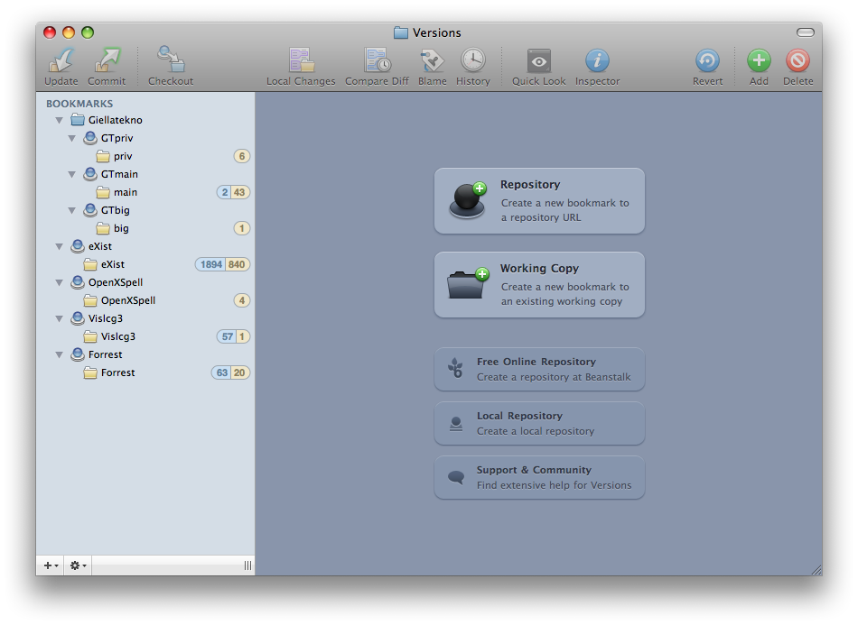
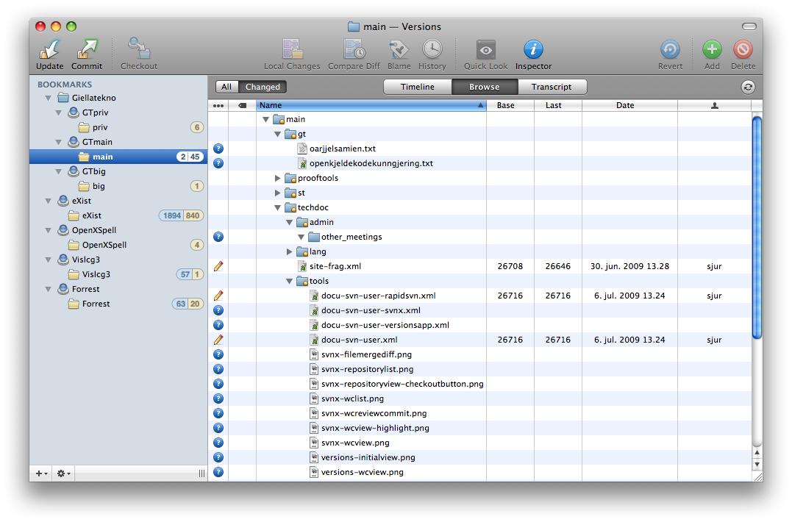
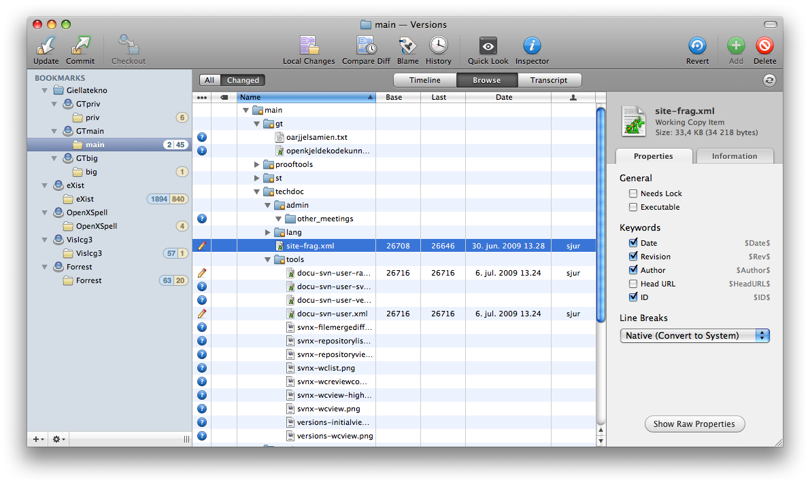
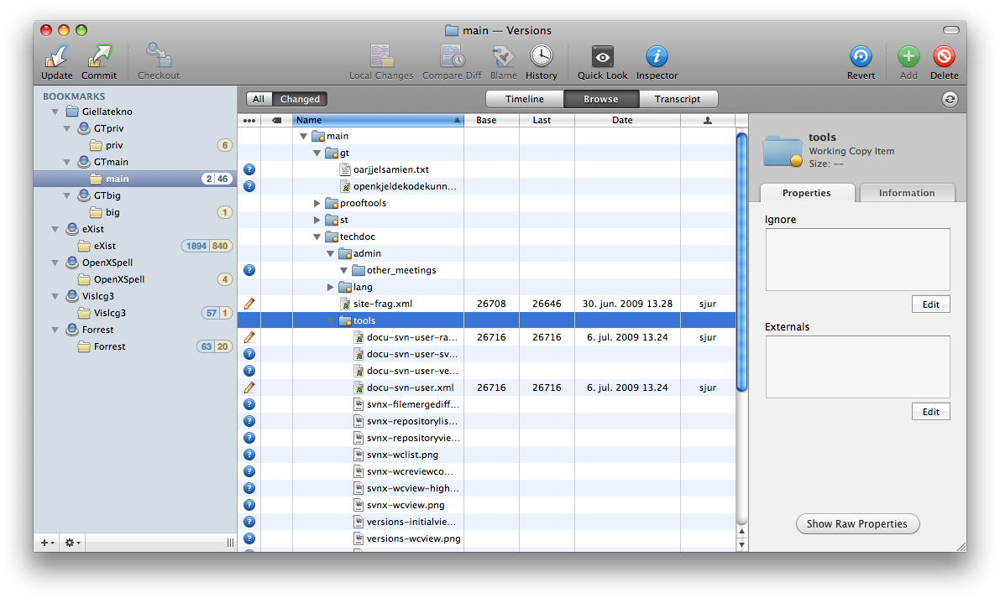

Initial setup
=============

Start **Versions** and click one of the big buttons **Repository** (if
you *don't* have a local working copy already) or **Working Copy** (if
you *do* have a working copy already) - fill in the details:

Working with the local working copy
===================================

When all is set up, Versions will give you a status listing directly in
the window. It will also indicate how many commits are in the repository
since you last updated (2 in the picture below). You can switch between
only seeing the modified (and unknown) files, or all files.

By turning on the inspector, it is very easy to change common
attributes:

or edit the ignore list:

Even with Versions (as compared to [SvnX](docu-svn-user-svnx.html)),
diffs will open in FileMerge. But Versions do a better job at providing
the real working copy file, and with a small script (found in
`$GTHOME/gt/src/filemerge-tools/` - run `make` there to install), all
files will open with the correct encoding, and merges done using
FileMerge will automatically be saved back to the working copy file.

Make sure that after you have installed the script (named
`FileMerge_SaveMergedToSecondFile.sh`), you open **Versions &gt;
Preferences**, and select the script in the **File Comparison**
drop-down menu:

