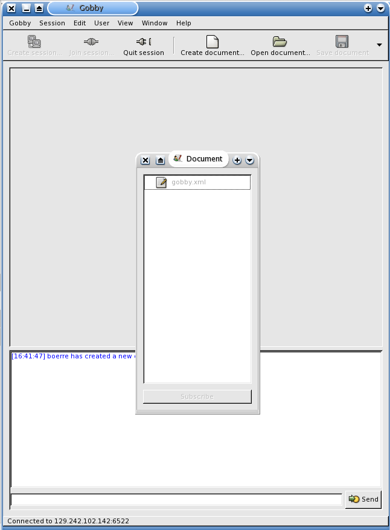

Introduction
============

Our project already uses
[SubEthaEdit](http://codingmonkeys.de/subethaedit) as a collaborative
editor. Sadly, this excellent editor is only available for the Mac OS X
platform. To be able to work collaboratively with others using other
platforms than Mac, we decided to use
[Gobby](http://darcs.0x539.de/trac/obby/cgi-bin/trac.cgi/wiki) for that
purpose. We use version 0.4x. (0.3 and 0.4 aren't compatible)

Installation
============

Windows
-------

The installation is documented on [Gobbys
download](http://gobby.0x539.de/trac/wiki/Download) page.

Linux
-----

To be able to execute the commands mentioned, you will have to have
superuser rights, or get the manager of your computer to install this
for you.

This depends a bit on your distribution. For debian-based distributions
(Debian, \*buntu) a simple `sudo apt-get install gobby` should suffice.
If you have a Red Hat-based distribution (Fedora, Mandrake, CentOS), the
magic chant should be: `sudo yum install gobby`. For Gentoo it is:
`sudo emerge gobby`.

You could also opt for the long and winding road of [installing from
source](http://gobby.0x539.de/trac/wiki/Download), but that really
shouldn't be necessary.

Mac OS X
--------

### Preprequisite: Mac OS X needs X11

To be able to run Gobby on Mac OS X, you will need X11 on your machine.
To check if you have X11 on your machine, issue the command `which X` in
Terminal. If the answer is `X is /usr/X11R6/bin/X` then you have it,
otherwise you will have to install X11.

To install X11 you will have to put the Mac OS X install DVD into your
DVD-drive. Open a terminal and write the following command:
`open /Volumes/Mac\ OS\ X\ Install\ DVD//System/Installation/Packages/X11User.pkg`.
An Installer window will be opened. Install the program as any Mac
applications, and you are ready to continue.

For more information on this topic Apple has written a longish document
on [installing and running
X11](http://developer.apple.com/opensource/tools/runningx11.html).

### The installation itself

The easiest way to install Gobby for Mac OS X, is
[fetching](http://divvun.no/downloads.html) and installing one of our
tarballs. If you have a PowerBook, choose the ppc version, if you have a
MacBook, choose the intel version. This will be placed on your desktop
as a file called `gobby-fink-<version>.tar.bz2`, where &lt;version&gt;
is either ppc or intel. This is actually a tarball of
[Fink](http://fink.sf.net) compiled for Mac OS X. Unpack this file using
the following command in Terminal:
`sudo tar xjf $HOME/Desktop/gobby-fink-<version>.tar.bz2 -C /`. You now
have an installation of Fink unstable, containing gobby in the folder
`/sw`.

Again, if you want to take a little longer path, you must install the
X11-SDK. The next step is to
[install](http://www.finkproject.org/download/index.php?phpLang=en) Fink
to your own machine, change `/sw/etc/fink.conf` so that the line that
reads `Trees: local/main stable/main stable/crypto` becomes
`Trees: local/main unstable/main unstable/crypto`. Update fink by
issuing the command `/sw/bin/fink selfupdate`. You can now install gobby
using the command `/sw/bin/fink -y install gobby`. This is going to take
a l-o-o-ng time, depending on the speed of your internet connection and
processor. Suggestion: Write this command shortly before going to bed,
and then sleep well.

When the fink installation is finished you can issue the following
command to "place" Gobby into your Applications folder:
`sudo ln -s /sw/bin/gobby /Applications/Gobby`.

Using Gobby
-----------

As Gobby is a cross-platform program, it works the same on all
platforms. Mac OS X users will probably feel a little surprised to find
that most of the shortcuts are bound to the Ctrl button, and not to the
Command button (e.g. Save is Ctrl-S, not Command-S).

### Starting up

In Windows and Linux you can search for Gobby in the menus. The fastest
way under Linux is to hold the Alt button down and then press F2. A
small dialog should appear. Write `gobby` into the text field and press
enter. In Mac OS X you will find Gobby in the Applications folder. You
will end up with a window looking like this: 

At the top you see a menubar, then a toolbar. Third is the *editing
pane*, where you edit documents. Below the editing pane is the *message*
pane. Here you can discuss with the other peers, and see when other
peers open documents. Below the message pane is a text field where you
can write messages to other peers. At the bottom is the status bar.

### Sessions/Co-editing documents

Before you can begin editing documents and send messages to your peers,
you will have to either *create* or *join* a session. If you are the
owner of document, then you will have to create a session, else you will
have to join a session.

#### Creating a session/Open file

Press the «Create session» button (the doublecomputer image in the upper
left corner). A dialog pops up: .

Leave the Port and Name field as they are, if you don't have a
particular reason for changing it. Fill in a password if you want that
in the dialog that pops up. Now press Ok. Open the file you want to edit
the usual way, then you are ready to go.

#### Joining a session/Co-editing documents

Press the «Join session» button (the next button to the right, the
connected cords). A dialog will pop up: .

If you are on the same network as your peer, you can press the small
triangle, with the label «Local network» to see other machines that are
running Gobby. If your peer is somewhere else, that peer will have to
give it's internet address (i.e., IP number) to you. If the peer does
not know this number (or if you don't know your own), there is a nice
service at <http://whatismyipnumber.com/>, which answers exactly that
question. Glue in the 12-number series (including intermediate dots) in
the *Host:* field. The next field, *Port:*, contains a number, e.g.
6522. Leave it unchanged. The third field gives your user name, leave
that as well. Then there is a colour field, indicating the colour of
your text. Change it if you don't like it (or if the program tells you
that this colour is taken by your co-participant). Press ok when you are
finished. After a short while you will end up with a window like this:
.

If your peer has open documents you can join them by pressing the
document you would like to co-edit, and then pressing the «Subscribe
button« at the bottom of the *Document list* window (yes, at the bottom,
and no, doubleclicking the document name will not suffice). The document
will be opened in the editing pane. Note that you also have the
possibility to «chat» with your peers below in the bottom pane below the
editing pane.The resulting window you see below: 

#### Quitting a session

If you are the owner of the document you will have to save the document
before you quit a session. Save the document, then press the «Quit
session» button (the disconnected cords), and then you are done.
